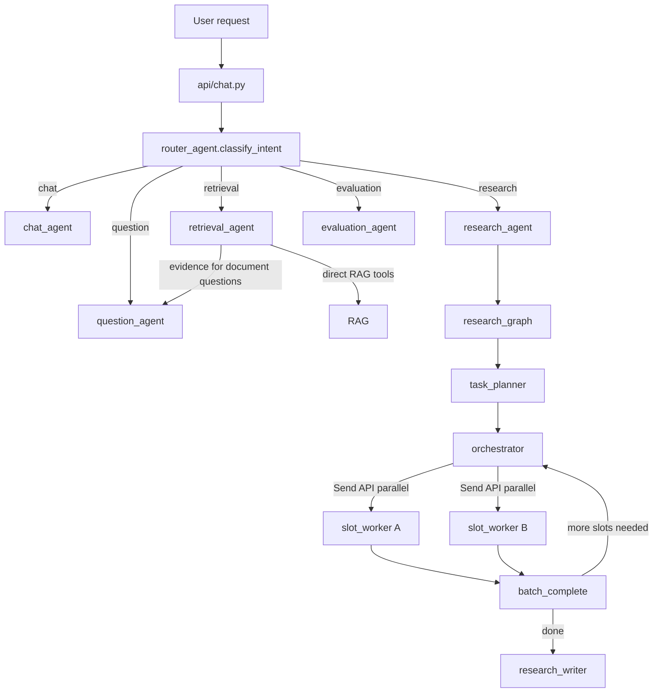

# Report Agent

RAG-based research PDF assistant for academic report analysis. Users upload PDFs, the backend parses and chunks documents, stores embeddings in Qdrant, and a multi-agent system answers questions, synthesizes research, and generates student-facing guidance.

## Start

### PostgreSQL

```powershell
cd D:\try
docker-compose up -d
```

### Backend

```powershell
cd backend
.venv\Scripts\python.exe -m uvicorn main:app --reload --host 127.0.0.1 --port 8200
```

### Frontend

```powershell
cd frontend
npm run dev
```

- Frontend: <http://localhost:5173>
- Backend docs: <http://localhost:8200/docs>

## Architecture

### Agent Roles

The system uses a router plus task agents.

```text
router_agent
  - owns request coordination
  - writes the root router trace
  - classifies user intent
  - uses route_coordinator as an internal fallback prompt
  - builds an ExecutionPlan for the selected task-agent step
  - dispatches to chat_agent, retrieval_agent, question_agent, research_agent, or evaluation_agent
  - handles explicit handoff through next_intent
  - can trigger post-run evaluation only when deterministic policy allows evaluate_after

chat_agent
  - default chat agent
  - has no RAG tools
  - answers pure chat turns and formats final responses
  - exposes compose_final_response for router-controlled final response formatting without tools
  - does not own agent-to-agent routing

retrieval_agent
  - focused document Q&A over attached PDFs
  - owns ordinary RAG tool access

question_agent
  - student-facing tutoring and question generation
  - has no RAG tools
  - uses evidence supplied by router when documents are involved

research_agent
  - multi-step LangGraph research workflow
  - also used by Extraction Pipeline Step 1

evaluation_agent
  - general output and trace evaluation
  - routed only for explicit evaluation requests or deterministic post-run evaluation policy
```

### Request Flow

```text
POST /api/chat or POST /api/chat/stream
  -> api/chat.py
     -> agents/router_agent.py
        -> router trace root
        -> ExecutionPlan
        -> intent = chat
           -> chat_agent
        -> intent = retrieval
           -> retrieval_agent
        -> intent = question
           -> if documents attached
              -> retrieval_agent
              -> question_agent
           -> else
              -> question_agent
        -> intent = research
           -> research_agent
        -> intent = evaluation
           -> evaluation_agent
        -> optional evaluate_after
           -> evaluation_agent runs in the background
```



### Intent Classification

```text
1. keyword fast path
   -> question keywords => question
   -> research or summary keywords => research
   -> retrieval, source, or PDF keywords => retrieval
   -> no documents => chat
   -> otherwise => uncertain

2. uncertain intent
   -> short follow-up after research/retrieval inherits the previous route_intent
   -> otherwise router_agent calls route_coordinator
```

`route_coordinator` is not an agent. It is an internal prompt used by `router_agent`.

### Router Execution Plan

`router_agent` owns an explicit execution plan for each user request.

```text
ExecutionPlan
  router_run_id
  route
  steps
    -> ExecutionStep(intent, agent_name, run_id, parent_run_id, kind)
    -> optional evidence_collection step handled by retrieval_agent
    -> primary task-agent step
    -> optional final composition step handled by chat_agent without tools
  evaluate_after
```

The default routes use one primary task-agent step per request, except document-backed question generation, which runs `retrieval_agent -> question_agent`. If a route explicitly sets `compose_after`, router runs `chat_agent.compose_final_response()` after the task result. That composition step has no RAG tools and is only for final user-facing formatting.

Background evaluation is gated by deterministic policy. `evaluate_after` is honored only for document-grounded `research`, `retrieval`, and `question` outputs. Explicit evaluation requests route directly to `evaluation_agent`. Extraction Pipeline Step 4 remains `summary_quality` and does not use `evaluation_agent`.

### Research Pipeline

Used by chat-triggered research tasks and Extraction Pipeline Step 1.

```text
research_agent.run_research_task()
  -> task_planner
  -> research_graph
     -> orchestrator (LLM decides which slots are ready to search)
     -> slot_worker × N in parallel (plan + search + reflect per slot)
     -> batch_complete (merge results, update consecutive_no_new)
     -> repeat until coverage is sufficient or budget exhausted
     -> research_writer
```

| Node | File | Purpose |
| ---- | ---- | ------- |
| task_planner | `agents/research/task_planner.py` | Creates coverage items and output contract |
| orchestrator | `agents/research/orchestrator.py` | LLM decides which slots have enough context to search now; dispatches workers via Send API |
| slot_worker | `agents/research/research_graph.py` | Per-slot worker: plan query → retrieve → reflect (combined into one node) |
| batch_complete | `agents/research/research_graph.py` | Merges parallel worker results; updates `consecutive_no_new` |
| research_planner | `agents/research/planner.py` | Per-slot query planning (`plan_query_for_slot`) |
| retriever | `agents/research/retriever.py` | Runs `search_report` |
| research_reflector | `agents/research/reflector.py` | Evaluates chunks and updates slot status |
| research_writer | `agents/research/writer.py` | Writes final answer per output contract |
| state | `agents/research/state.py` | Tracks coverage items, evidence, slot status; merge reducers for parallel writes |

#### Parallel Execution

The research graph uses LangGraph's `Send` API to dispatch multiple `slot_worker` nodes in parallel. The orchestrator (an LLM call) decides which coverage slots have sufficient context to search in the current batch. Each worker independently runs plan → retrieve → reflect and returns a delta patch. Merge reducers on `ResearchGraphState` handle concurrent writes to `evidence`, `slot_status`, `known_keywords`, and related fields.

### Extraction Pipeline

Summary Page extraction runs as a background job.

```text
Step 1: research_agent.run_research_summary() -> raw research summary
Step 2: summary_structure (extract_step2 stack) -> structured summary fields
Step 3: question_generator (extract_step3 stack) -> intro and questions
Step 4: summary_quality (extract_step4 stack) -> extraction quality score
```

Step 2 and Step 3 run in parallel. Step 3 uses Step 1's raw summary as input.

`summary_quality` is an extraction step, not a standalone agent.

## Key Backend Files

| File | Role |
| ---- | ---- |
| `main.py` | FastAPI app entry, startup, routers, job workers |
| `agents/router_agent.py` | Intent classification and request routing |
| `agents/chat_agent.py` | No-tool chat and final response composition |
| `agents/runner.py` | Tool-enabled LangGraph runner used by retrieval_agent |
| `agents/retrieval_agent.py` | Focused document Q&A task agent |
| `agents/question_agent.py` | Question and tutoring task agent |
| `agents/research/agent.py` | Research pipeline entry point (`run_research_task`, `run_research_summary`) |
| `agents/research/orchestrator.py` | Batch orchestrator: slot readiness decision and candidate filtering |
| `agents/research/research_graph.py` | LangGraph graph definition: orchestrator_node, slot_worker_node, batch_complete_node |
| `agents/research/planner.py` | Per-slot query planner (`plan_query_for_slot`) |
| `agents/research/state.py` | ResearchGraphState with merge reducers; WorkerState |
| `agents/evaluation_agent.py` | General output and trace evaluation agent |
| `api/chat.py` | Chat and streaming API |
| `api/summaries.py` | Summary management and extraction endpoints |
| `api/traces.py` | Local trace monitor API |
| `services/extraction.py` | Summary Page extraction pipeline |
| `services/extraction_quality.py` | Extraction Step 4 quality scoring |
| `services/job_service.py` | Background job scheduling |
| `tools/rag_tool.py` | AgentContext and RAG tools |
| `rag/` | PDF parsing, chunking, embeddings, Qdrant ingestion and search |
| `db/` | SQLAlchemy models, DB session (`db_session()`), migrations |
| `observability/` | Langfuse tracing, `ainvoke_traced_generation()` |
| `eval/runner.py` | Routing accuracy evaluation |
| `eval/dataset.json` | Routing eval test cases |

## Prompt System

Prompt files: `backend/prompts/`

Prompt infrastructure: `backend/prompting/registry.py`, `backend/prompting/loader.py`

| Prompt | Used in |
| ------ | ------- |
| `core.txt` | Shared base prompt in main stacks |
| `retrieval_capability.txt` | retrieval_default |
| `chat_mode.txt` | chat_default |
| `question_skill.txt` | question_default |
| `route_coordinator.txt` | router_agent internal fallback classification and evaluation-policy prompt |
| `evaluation_agent.txt` | evaluation_default |
| `task_planner.txt` | research_runtime task planning |
| `research_orchestrator.txt` | research_runtime orchestrator node (slot readiness) |
| `research_planner.txt` | research_runtime per-slot query planning |
| `research_reflector.txt` | research_runtime evidence reflection node |
| `research_writer.txt` | research_runtime final writing node |
| `summary_structure.txt` | extract_step2 |
| `question_generator.txt` | extract_step3 |
| `summary_quality.txt` | extract_step4 |

Prompt stacks:

```text
chat_default:       core + chat_mode
question_default:   core + question_skill
retrieval_default:  core + retrieval_capability
evaluation_default: core + evaluation_agent
router_default:     core + route_coordinator
research_runtime:   core + task_planner + research_orchestrator + research_planner + research_reflector + research_writer
extract_step2:      core + summary_structure
extract_step3:      core + question_generator
extract_step4:      core + summary_quality
```

Hot reload:

```http
POST /api/prompts/reload
```

## Trace Metadata

Trace records are stored in PostgreSQL `traces`.

```text
run_id, parent_run_id, thread_id, task_type, route_intent, agent_name
prompt_name, prompt_version, prompt_stack_name, prompt_stack_json
primary_prompt_json, workflow_prompts_json, prompt_stack_tokens
tool_count, llm_call_count, quality_score, quality_detail, user_feedback, display
```

`parent_run_id` expresses trace hierarchy in the same table. `router_agent` writes the root trace for chat requests. The selected task agent is written as a child trace by using the router trace `run_id` as `parent_run_id`.

Prompt fields are intentionally additive:

```text
prompt_name / prompt_version: legacy primary prompt fields
prompt_stack_json: full loaded prompt stack
primary_prompt_json: explicit primary prompt object with name and version
workflow_prompts_json: prompts used by the workflow step
```

Langfuse generation observations also receive compact prompt metadata:

```text
prompt_stack_name
primary_prompt: { name, version }
prompt_stack_json
agent_name, task_type, route_intent
```

This is attached by `observability.ainvoke_traced_generation()` for manual LLM calls such as router classification, extraction steps, no-tool chat/question calls, evaluation, and research graph nodes.

`task_type` describes the work category, for example:

```text
chat_turn
response_composition
retrieval_qa
question_generation
research_task
document_extraction
evaluation
routing
```

`route_intent` describes router intent when the trace came from a chat request:

```text
chat
retrieval
question
research
```

## Data Stores

| Store | Purpose | Default |
| ----- | ------- | ------- |
| PostgreSQL | Documents, conversations, messages, traces, jobs | `127.0.0.1:5432/reportdb` (Docker) |
| Qdrant | Dense + sparse vector search | Cloud (`QDRANT_URL` + `QDRANT_API_KEY`) |
| Disk / Azure Blob | Raw PDF files | `backend/uploads/` or configured blob container |

## Environment

```text
AZURE_OPENAI_ENDPOINT
AZURE_OPENAI_API_KEY
AZURE_OPENAI_API_VERSION
AZURE_CHAT_DEPLOYMENT
AZURE_MINI_DEPLOYMENT
AZURE_EMBEDDING_DEPLOYMENT
DATABASE_URL
QDRANT_URL
QDRANT_API_KEY
LANGFUSE_PUBLIC_KEY
LANGFUSE_SECRET_KEY
LANGSMITH_API_KEY
PROMPT_AB_TESTS
ENABLE_QUALITY_CHECK
AZURE_STORAGE_CONNECTION_STRING
AZURE_STORAGE_CONTAINER
CORS_ORIGINS
```

## Tests

Syntax check:

```powershell
python -m py_compile backend\agents\runner.py backend\agents\router_agent.py backend\agents\chat_agent.py backend\agents\research\agent.py backend\agents\research\research_graph.py backend\agents\research\orchestrator.py backend\agents\research\planner.py backend\agents\research\reflector.py backend\agents\research\writer.py backend\agents\research\retriever.py backend\agents\research\state.py backend\agents\research\task_planner.py backend\services\extraction.py
```

Focused tests:

```powershell
$env:PYTHONPATH='D:\try\backend;D:\try\backend\.venv\Lib\site-packages'
$env:AZURE_OPENAI_API_KEY='test'
$env:AZURE_OPENAI_ENDPOINT='https://example.openai.azure.com/'
$env:AZURE_OPENAI_API_VERSION='2024-02-15-preview'
$env:AZURE_OPENAI_CHAT_DEPLOYMENT='test'
D:\try\backend\.venv\Scripts\python.exe -m pytest backend\tests\test_agent_router.py backend\tests\test_prompt_versions.py backend\tests\test_traces_api.py backend\tests\test_chat_attachments.py backend\tests\test_research_graph.py -q
```

Routing accuracy eval:

```powershell
$env:PYTHONPATH='D:\try\backend;D:\try\backend\.venv\Lib\site-packages'
D:\try\backend\.venv\Scripts\python.exe backend\eval\runner.py
```

Or via API: `POST /api/eval/run`

## Utility Scripts

| Script | Purpose |
| ------ | ------- |
| `scripts/extract_abstracts.py` | Extract abstract text from uploaded PDFs |
| `scripts/import_abstracts.py` | Import extracted abstracts into Document.abstract_text |
| `scripts/batch_llamaparse.py` | Re-parse PDFs with LlamaParse |
| `scripts/scan_quality.py` | Scan extraction quality scores |
| `scripts/debug_chunks.py` | Debug RAG chunk retrieval |
| `scripts/compare_rrf.py` | Compare equal-weight vs weighted RRF retrieval results |
