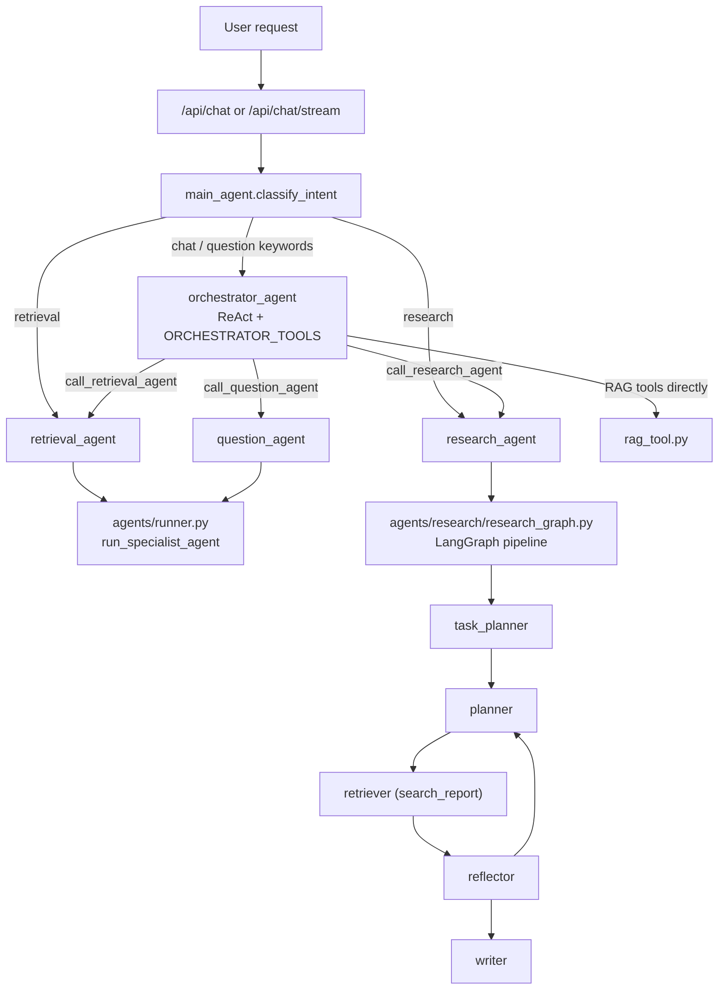

# Report Agent

RAG-based research PDF assistant for academic reports (大專生計畫). Users upload PDFs, the backend parses and chunks documents, stores embeddings in Qdrant, and a hierarchical multi-agent system answers questions, summarizes research, and generates student-facing intros and interest questions.

## Start

### PostgreSQL

```powershell
cd D:\try
docker-compose up -d
```

### Backend

```powershell
cd backend
.venv\Scripts\python.exe -m 
uvicorn main:app --reload --host 127.0.0.1 --port 8200
```

Visible terminal window:

```powershell
Start-Process powershell.exe -ArgumentList @(
  '-NoExit',
  '-Command',
  'cd D:\try\backend; .\.venv\Scripts\python.exe -m uvicorn main:app --reload --host 127.0.0.1 --port 8200'
)
```

### Frontend

```powershell
cd frontend
npm run dev
```

Visible terminal window:

```powershell
Start-Process powershell.exe -ArgumentList @(
  '-NoExit',
  '-Command',
  'cd D:\try\frontend; npm.cmd run dev'
)
```

- Frontend: <http://localhost:5173>
- Backend docs: <http://localhost:8200/docs>

## Architecture

### Hierarchical Agent-as-Tool

The system uses a hierarchical multi-agent pattern. `orchestrator_agent` is the top-level entry point for all chat-intent requests. It holds both RAG tools and sub-agent tools, deciding which to call based on the user's request.

```text
POST /api/chat  or  POST /api/chat/stream
  └─ api/chat.py
       └─ agents/main_agent.py  (classify_intent)
            │
            ├─ intent = "chat" (incl. question keywords)
            │    └─ orchestrator_agent  (ReAct loop, ORCHESTRATOR_TOOLS)
            │         ├─ RAG tools: search_report, verify_claim, search_by_section,
            │         │             compare_documents, get_document_metadata, web_search
            │         ├─ call_question_agent()  → question_agent.answer()
            │         ├─ call_retrieval_agent() → retrieval_agent.answer()
            │         └─ call_research_agent()  → run_research_task()
            │
            ├─ intent = "retrieval"
            │    └─ retrieval_agent  (specialist ReAct, RAG tools only)
            │         └─ [escalation] next_intent="research" if no sources + research keywords
            │
            └─ intent = "research"
                 └─ research_agent  (LangGraph StateGraph pipeline)
```



### Intent Classification

```text
1. keyword fast-path (_keyword_classify)
   ├─ question keywords (出題/問我/測驗/導讀...) → "chat"  (orchestrator handles internally)
   ├─ research keywords (摘要/總結/懶人包...)    → "research"
   ├─ retrieval keywords (這篇/哪一頁/pdf...)    → "retrieval"
   └─ otherwise                                  → "uncertain"

2. if uncertain:
   ├─ short follow-up + previous was research/retrieval → inherit previous intent
   └─ else → LLM router (intent_router.txt, outputs: chat | retrieval | research)
```

### Research Pipeline

Used by both chat research mode and Summary Page Step 1.

```text
research_agent.run_research_task()
  └─ research_graph (LangGraph StateGraph)
       task_planner → planner → retriever → reflector → planner → ... → writer
```

| Node | File | Purpose |
| ---- | ---- | ------- |
| task_planner | `agents/research/task_planner.py` | Creates coverage items and output contract |
| planner | `agents/research/planner.py` | Chooses next query and target slot |
| retriever | `agents/research/retriever.py` | Runs `search_report` tool |
| reflector | `agents/research/reflector.py` | Evaluates chunks, updates slot status |
| writer | `agents/research/writer.py` | Writes final answer per output contract |
| state | `agents/research/state.py` | Tracks coverage items, evidence, slot status |

### Extraction Pipeline

Summary Page extraction runs as a background job.

```text
Step 1: research_agent.run_research_summary()   → raw research summary
Step 2: structured LLM (extract_step2 stack)    → motivation / method / results / tags
Step 3: structured LLM (extract_step3 stack)    → intro / questions
Step 4: quality_agent.score_extraction()         → quality score  (ENABLE_QUALITY_CHECK=true)
```

Step 2 and Step 3 run in parallel. Step 3 uses Step 1's raw summary as input.

## Key Backend Files

| File | Role |
| ---- | ---- |
| `main.py` | FastAPI app entry, startup, routers, job workers |
| `agents/runner.py` | LangGraph agent execution engine (specialist + orchestrator instances) |
| `agents/main_agent.py` | Intent classification and request routing |
| `agents/orchestrator_agent.py` | Top-level orchestrator with RAG + sub-agent tools |
| `agents/retrieval_agent.py` | Focused document Q&A specialist |
| `agents/question_agent.py` | Question/tutoring specialist |
| `agents/research_agent.py` | Research pipeline entry point |
| `agents/agent_tools.py` | Sub-agent tools: call_question_agent, call_retrieval_agent, call_research_agent |
| `agents/research/` | Research pipeline internals (state, graph, planner, reflector, retriever, writer, task_planner, runtime_prompts) |
| `agents/quality_agent.py` | Quality scoring for extraction (Step 4) |
| `api/chat.py` | Chat and streaming API |
| `api/summaries.py` | Summary management and extraction endpoints |
| `services/extraction.py` | Summary Page extraction pipeline |
| `services/job_service.py` | Background job scheduling |
| `tools/rag_tool.py` | AgentContext, TOOLS, search/verify/compare tools |
| `rag.py` | PDF parsing, chunking, embeddings, Qdrant ingestion and search |
| `tracer.py` | Local trace persistence (LocalTracer) |
| `database.py` | SQLAlchemy models and DB session |
| `eval/runner.py` | Routing accuracy evaluation (used by POST /api/eval/run) |
| `eval/dataset.json` | Routing eval test cases |

## Prompt System

Prompt files: `backend/prompts/`

Prompt infrastructure: `backend/prompting/registry.py`, `backend/prompting/loader.py`

| Prompt | Used in |
| ------ | ------- |
| `core.txt` | All main stacks |
| `retrieval_capability.txt` | chat_default, retrieval_default, chat_question |
| `chat_mode.txt` | chat_default (includes orchestrator sub-agent tool guidance) |
| `question_skill.txt` | chat_question |
| `summary_mode.txt` | research_summary |
| `summary_quality.txt` | research_summary |
| `summary_structure.txt` | extract_step2 |
| `question_generator.txt` | extract_step3 |
| `intent_router.txt` | LLM fallback routing (chat / retrieval / research) |
| `task_planner.txt` | Research Runtime coverage planning |
| `research_planner.txt` | Research Runtime query planning node |
| `research_reflector.txt` | Research Runtime evidence reflection node |
| `research_writer.txt` | Research Runtime final writing node |

Prompt stacks:

```text
chat_default:      core + retrieval_capability + chat_mode
retrieval_default: core + retrieval_capability
chat_question:     core + retrieval_capability + question_skill
research_summary:  core + retrieval_capability + summary_mode + summary_quality
extract_step2:     core + summary_structure
extract_step3:     core + question_generator
```

Hot reload:

```http
POST /api/prompts/reload
```

## Trace Metadata

Trace records stored in PostgreSQL `Trace` table:

```text
run_id, parent_run_id, thread_id, mode, agent_name
prompt_name, prompt_version, prompt_stack_name, prompt_stack_json, prompt_stack_tokens
tool_count, llm_call_count, quality_score, user_feedback, display
```

Sub-agent traces (from call_question_agent / call_retrieval_agent / call_research_agent) have `parent_run_id` pointing to the orchestrator's `run_id`.

## Data Stores

| Store | Purpose | Local default |
| ----- | ------- | ------------- |
| PostgreSQL | Documents, conversations, messages, traces, jobs | `127.0.0.1:5432/reportdb` |
| Qdrant | Dense + sparse vector search | `http://localhost:6333` |
| Disk / Azure Blob | Raw PDF files | `backend/uploads/` or configured blob container |

## Environment

```text
AZURE_OPENAI_ENDPOINT
AZURE_OPENAI_API_KEY
AZURE_OPENAI_API_VERSION
AZURE_CHAT_DEPLOYMENT
AZURE_MINI_DEPLOYMENT
AZURE_EMBEDDING_DEPLOYMENT
DATABASE_URL
QDRANT_URL
QDRANT_API_KEY
PROMPT_AB_TESTS
ENABLE_QUALITY_CHECK
AZURE_STORAGE_CONNECTION_STRING
AZURE_STORAGE_CONTAINER
CORS_ORIGINS
```

## Tests

Syntax check:

```powershell
python -m py_compile backend\agents\runner.py backend\agents\orchestrator_agent.py backend\agents\main_agent.py backend\agents\research_agent.py backend\agents\research\research_graph.py backend\agents\research\planner.py backend\agents\research\reflector.py backend\agents\research\writer.py backend\agents\research\retriever.py backend\agents\research\state.py backend\agents\research\task_planner.py backend\services\extraction.py
```

Router and prompt stack tests:

```powershell
$env:PYTHONPATH='D:\try\backend;D:\try\backend\.venv\Lib\site-packages'
& 'C:\Users\Joy\AppData\Local\Programs\Python\Python311\python.exe' -m pytest backend\tests\test_agent_router.py backend\tests\test_prompt_versions.py -q
```

Routing accuracy eval:

```powershell
$env:PYTHONPATH='D:\try\backend;D:\try\backend\.venv\Lib\site-packages'
& 'C:\Users\Joy\AppData\Local\Programs\Python\Python311\python.exe' backend\eval\runner.py
```

Or via API: `POST /api/eval/run`

## Utility Scripts

| Script | Purpose |
| ------ | ------- |
| `scripts/extract_abstracts.py` | Extract abstract text from uploaded PDFs, output to `scripts/pdf_abstracts.json` |
| `scripts/import_abstracts.py` | Import `pdf_abstracts.json` into `Document.abstract_text` |
| `scripts/batch_llamaparse.py` | Re-parse PDFs with LlamaParse |
| `scripts/scan_quality.py` | Scan extraction quality scores |
| `scripts/debug_chunks.py` | Debug RAG chunk retrieval |
