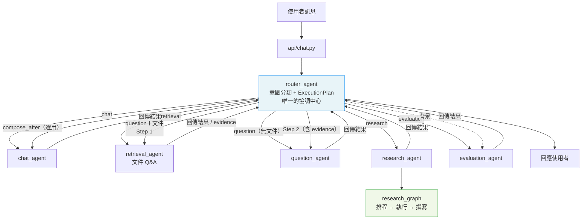
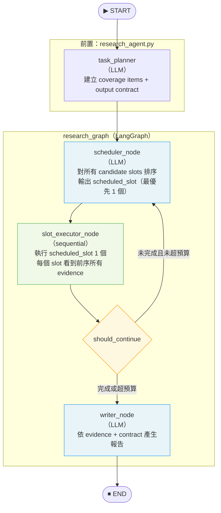
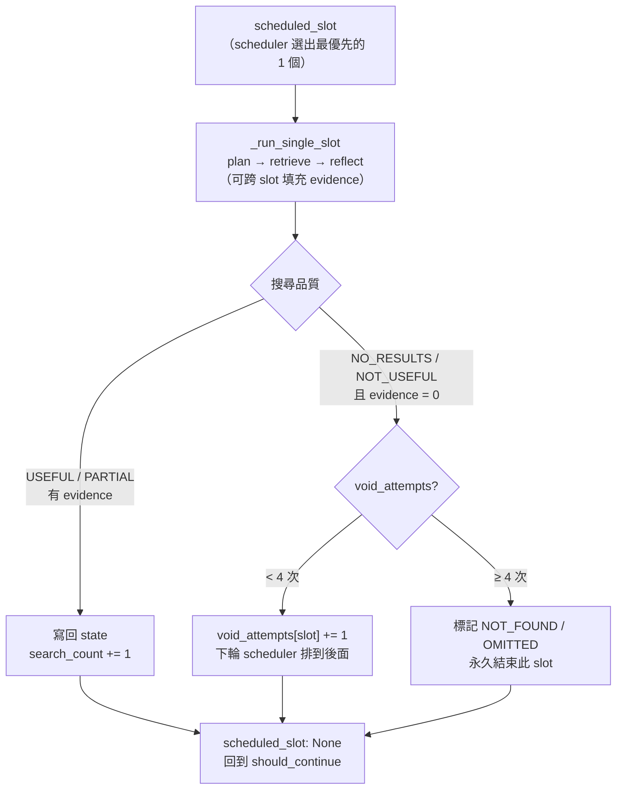
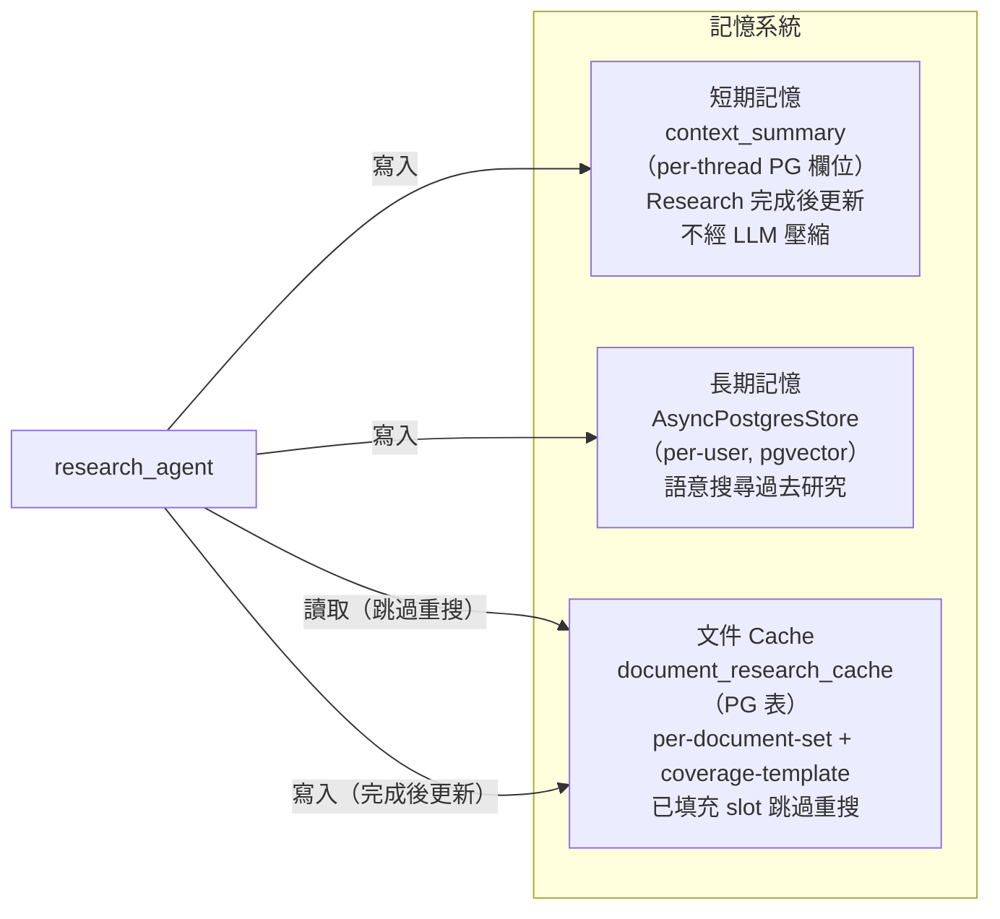
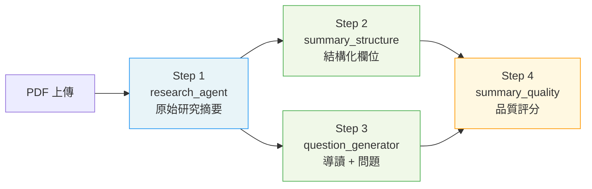

# 系統架構文件

## 概覽

Report Agent 是一套 RAG-first 多代理人學術研究助理，核心設計原則：

- **檢索品質決定回答品質**：所有回答都建立在真實文件 evidence 上
- **代理人分工明確**：Router 負責協調，各 Agent 只做自己的事
- **Research Graph 是核心**：多輪 coverage-driven 搜尋，不憑空生成

---

## 整體請求流程

所有 agent 的結果都回傳給 router，由 router 統一回應使用者。唯一特殊的是 question+文件流程中，retrieval 的 evidence 先回 router，router 再傳給 question。



---

## 各代理人職責

### router_agent

**檔案：** `agents/router_agent.py`  
**Prompt：** `core` + `route_coordinator`（fallback 時才呼叫 LLM）

**職責：**

- 擁有整個請求的協調權，是唯一知道完整 ExecutionPlan 的角色
- 意圖分類：先走 keyword fast path，uncertain 才呼叫 `route_coordinator` LLM
- 建立 `ExecutionPlan`，決定哪些 agent 按哪個順序執行
- 寫入 root router trace（其他 agent 的 trace 以此為 parent）
- 決定是否在任務後執行 evaluate_after（限 research / retrieval / question）

**設計決策：**

- `route_coordinator` 不是 agent，是 router 內部使用的 fallback prompt
- Router 不做實際回答，只做協調
- `evaluate_after` 有 deterministic policy 門檻，防止濫用 LLM

---

### chat_agent

**檔案：** `agents/chat_agent.py`  
**Prompt：** `core` + `chat_mode`

**職責：**

- 純文字對話（無 RAG tools）
- 格式化最終回應（`compose_final_response`）—— 只有 router 呼叫，不被其他 agent 直接呼叫

**設計決策：**

- 不持有 agent-to-agent routing 邏輯
- Streaming 透過 `no_tool_runner.py` 的 `stream_no_tool_agent()` 實現
- `compose_after` 是 router 控制的選用 Step 3，chat_agent 在這裡扮演格式化角色

---

### retrieval_agent

**檔案：** `agents/retrieval_agent.py`  
**Prompt：** `core` + `retrieval_capability`  
**Tools：** `search_report`（RAG），`AgentContext` 含文件 metadata

**職責：**

- 單點文件 Q&A：搜尋特定資訊、引用、方法、結果
- 當 intent=question 且有文件時，作為 Step 1 收集 evidence（**不直接呼叫 question_agent**）

**設計決策：**

- 用 LangGraph tool agent（`runner.py`），有 checkpoint + 記憶注入
- Middleware stack 保護：token limit、model fallback、retry
- 永遠回傳到 router_agent，由 router 決定是否把 evidence 傳給 question_agent

---

### question_agent

**檔案：** `agents/question_agent.py`  
**Prompt：** `core` + `question_skill`

**職責：**

- 學生導向：出題、測驗、互動導讀
- 無 RAG tools，使用 router 傳入的 evidence 或純 LLM 知識

---

### evaluation_agent

**檔案：** `agents/evaluation_agent.py`  
**Prompt：** `core` + `evaluation_agent`

**職責：**

- 對任務 trace 進行品質評分（0-1）
- 只在 deterministic policy 允許時由 router 觸發（背景執行）
- 或由使用者明確要求評估時直接路由

---

### research_agent

**檔案：** `agents/research/agent.py`  
**Prompt stack：** `research_runtime`（5 個 prompt 組合）

**職責：**

- 執行多輪 coverage-driven 研究圖
- 載入 document research cache（跳過已填充的 slot）
- 完成後寫入長期記憶

→ 詳見「Research Graph 詳解」

---

## Research Graph 詳解

### 架構圖



### slot_executor 內部（序列執行）



**序列執行的優勢**：每個 slot 開始前能看到所有前序 slot 的完整 evidence，reflector 的跨 slot 填充效益最大化，避免重複搜尋相同內容。

### 各節點職責與 Prompt

| 節點 | 類型 | Prompt | 核心職責 |
| ---- | ---- | ------ | ------- |
| **task_planner** | LLM | `task_planner` | 分析問題，建立 coverage items（研究維度）和 output contract |
| **scheduler_node** | LLM | `research_scheduler` | 對所有 candidate slots 排序，選出最優先的 1 個輸出為 scheduled_slot |
| **slot_executor_node** | async | — | 執行 scheduled_slot，void 計數，結果寫回 state |
| **_run_single_slot** | async fn | `research_planner` + `research_reflector` | plan query → RAG 搜尋 → 反思更新 evidence（含跨 slot 填充） |
| **writer_node** | LLM | `research_writer` | 依 evidence 和 output contract 產生最終報告，品質門檻重試 |
| **should_continue** | deterministic + `@observe` | — | 路由 scheduler / writer；依序檢查：全域預算、所有 required slots terminal、連續空白 stall、無剩餘候選 |

### SlotStatus 語意

| 狀態 | 含義 | Writer 行為 |
| ---- | ---- | ---------- |
| `FILLED` | 有充足 evidence | 完整輸出 |
| `PARTIAL` | 有部分 evidence，全局預算到頂時停止 | 有多少說多少 |
| `EXHAUSTED` | 達 per_slot_cap（7次）停止 | 有多少說多少 |
| `NOT_FOUND` | 4 次 void，required slot，文件可能無此資訊 | 說明「未提及」 |
| `OMITTED` | 4 次 void，optional slot，文件可能無此資訊 | 省略 |

---

## 工具代理人 Middleware Stack

`runner.py` 建立的 tool agent（retrieval_agent 使用）具有以下 middleware 層：

```mermaid
flowchart LR
    REQ["使用者請求"] --> M1
    subgraph MIDDLEWARE["Middleware Stack（由上到下）"]
        M1["@dynamic_prompt _memory_prompt<br>動態 system prompt + 記憶注入"]
        M2["@after_model _track_model_cost<br>Token 計費 log"]
        M3["@before_model _trim_messages<br>訊息數量上限（20 條）"]
        M4["SummarizationMiddleware<br>舊訊息壓縮"]
        M5["ContextEditingMiddleware<br>清除過期 tool results"]
        M6["ModelCallLimitMiddleware<br>模型呼叫上限（15 次）"]
        M7["ModelFallbackMiddleware<br>主模型失敗 → mini 模型"]
        M8["ModelRetryMiddleware<br>結構化輸出解析失敗重試"]
        M9["ToolRetryMiddleware<br>瞬態 tool 錯誤重試"]
        M10["HumanInTheLoopMiddleware<br>interrupt_on={}<br>（目前全唯讀工具，無中斷）"]
    end
    M1 --> M2 --> M3 --> M4 --> M5 --> M6 --> M7 --> M8 --> M9 --> M10 --> LLM["LLM"]
```



---

## 記憶系統

三層記憶，由 `services/agent_memory.py` 統一以 MemoryPolicy 管理：



| Intent | 讀 context_summary | 讀長期記憶 | 讀 doc cache | 寫 context_summary | 寫長期記憶 |
| ------ | :----------------: | :-------: | :----------: | :----------------: | :-------: |
| research | ✓ | ✓ | ✓ | ✓ | ✓ |
| retrieval | ✓ | — | ✓ | — | — |
| question | ✓ | — | — | — | — |
| chat | ✓ | ✓ | — | — | — |

---

## 文件摘取管線

索引一份 PDF 時，背景依序執行四個 step：



Step 2 和 Step 3 平行執行。`summary_quality` 是摘取 step，不是獨立 agent。

---

## Prompt 架構設計

所有 prompt 使用 `# extends:` 繼承機制，runtime 熱載入：

```text
core.txt                    ← 所有 stack 的共用基底
  ├── chat_mode.txt         ← chat_default
  ├── retrieval_capability.txt ← retrieval_default
  ├── question_skill.txt    ← question_default
  ├── evaluation_agent.txt  ← evaluation_default
  ├── route_coordinator.txt ← router_default（fallback 分類）
  ├── task_planner.txt      ┐
  ├── research_scheduler.txt│
  ├── research_planner.txt  ├─ research_runtime（5個合一）
  ├── research_reflector.txt│
  ├── research_writer.txt   ┘
  ├── summary_structure.txt ← extract_step2
  ├── question_generator.txt← extract_step3
  └── summary_quality.txt   ← extract_step4
```

**Prompt 職責分工（Research）：**

| Prompt | 決策類型 | 呼叫頻率 |
| ------ | ------- | ------- |
| `task_planner` | 建立研究維度（coverage items） | 每次任務 1 次 |
| `research_scheduler` | 排序全部 candidate slots，選出下一個執行 | 每個 slot 執行前 1 次（5 slots ≈ 5 次） |
| `research_planner` | 規劃單一 slot 的搜尋查詢 | 每個 slot 1 次 |
| `research_reflector` | 評估 chunk 品質、更新 evidence | 每個 slot 1 次 |
| `research_writer` | 根據 evidence 撰寫最終報告 | 每次任務 1-2 次 |

---

## Trace 追蹤架構

TraceV2 以 `traces_v2` 作為一次 request 的 root 容器，細節步驟寫入 `observations`，評分與回饋寫入 `scores`。

```text
traces_v2
├── trace_id（request root）
├── thread_id / user_id / environment
├── input / output
├── tags
└── metadata_json（只保留 request-level extras，例如 agent_name、document_ids）

observations
├── observation_id
├── trace_id
├── parent_observation_id
├── type（SPAN / GENERATION / TOOL）
├── status / status_message
├── prompt_name / prompt_version
└── token、cost、model、input/output、step metadata
```

Trace root 不保存 prompt stack、display、run_type、token、error、tool_count 或 llm_call_count。Trace Monitor 的 root `status/error/tokens/counts/quality` 都由 observations 與 scores 聚合產生；Prompt metrics/filter 由 observation-level `prompt_name/prompt_version` 聚合。

---

## 非同步 I/O 設計

系統全面採用 async/await，避免阻塞 FastAPI event loop：

| 層次 | 實作方式 |
| ---- | ------- |
| **Qdrant 向量搜尋** | `AsyncQdrantClient` + `vectorstore.asimilarity_search()` |
| **Flashrank reranker**（CPU-bound） | `asyncio.to_thread(reranker.compress_documents, ...)` |
| **資料庫讀寫**（SQLAlchemy sync） | `asyncio.to_thread(db_func, ...)` |
| **on_stage 回呼** | `_emit_stage()` 支援 sync / async 兩種 callback |
| **chat 串流** | event queue + sentinel 模式（token / stage 合併佇列） |

### 串流架構（研究任務）

```text
event_queue = asyncio.Queue()
task = asyncio.create_task(run_research_agent(..., on_stage=_push_stage, on_token=_push_token))
task.add_done_callback(lambda _: event_queue.put_nowait(None))  # sentinel

while True:
    event = await event_queue.get()
    if event is None: drain remaining → break
    yield SSE event
```

---

## 環境變數

| 變數 | 預設 | 說明 |
| ---- | ---- | --- |
| `BYPASS_RESEARCH_CACHE` | `false` | 設為 `true` / `1` 時跳過 document research cache，強制重新搜尋所有 slots（用於測試） |
| `CORS_ORIGINS` | `http://localhost:5173,http://localhost:3000` | 允許的前端來源；部署時改為正式網域 |
