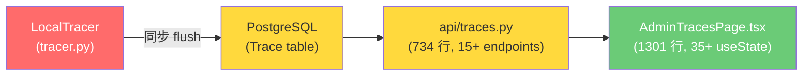
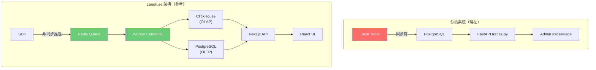
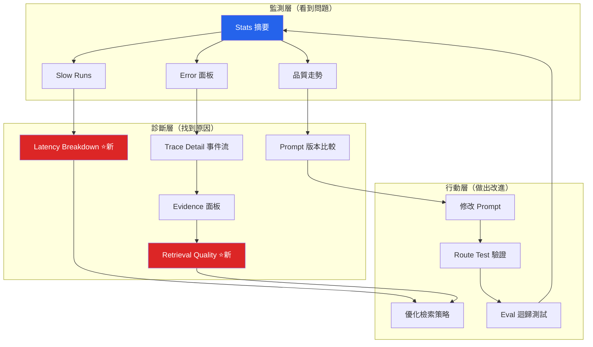

# Trace Monitor 使用說明

Trace Monitor 是系統的可觀測性面板，記錄每一次使用者和 AI 的對話，讓你能看到：模型選了哪條路由、搜了什麼、找到什麼證據、最後怎麼寫出答案。

---

## 概念：什麼是 trace？

每次使用者送出一則訊息，系統就會產生一筆 **trace（追蹤記錄）**。一筆 trace 包含：

- **root trace**：這次請求的總記錄（有品質分、延遲、回應摘要）
- **child traces**：root 底下的子節點，例如每次 LLM 呼叫、每次工具執行

Trace Monitor 預設只顯示 root trace。

---

## 頁面結構

### 頂部數字卡片
| 欄位 | 說明 |
|------|------|
| Total runs | 歷史總 trace 數 |
| Errors | 有真實錯誤的 trace 數（客戶端斷線不算） |
| Avg latency | 近期平均回應秒數 |
| Top prompt | 最常被使用的 prompt |

---

### 過濾列

用來縮小你想查看的 trace 範圍。

| 欄位 | 說明 |
|------|------|
| Route Intent | 路由結果：`chat` / `retrieval` / `research` / `question` |
| Prompt | 主 prompt 名稱（e.g. `research_writer`） |
| Version | Prompt 版本，顯示為 `#abc123`（hover 看完整 hash） |
| Status | `success` / `error` |
| Min latency | 只顯示超過幾秒的 trace，用來找慢請求 |
| Original Intent | LLM 分類器的原始意圖決定 |
| Resolved Intent | normalize 後實際執行的意圖 |

> **Original ≠ Resolved** 代表有發生路由升級，例如 `retrieval → research`。

---

### 分組統計表

- **By Route Intent**：各路由意圖的執行次數、錯誤數、平均延遲、品質分
- **By Prompt**：哪個 prompt 被用最多、品質好不好
- **By Prompt Version**：同一個 prompt 改版前後的比較（數字變化看效果）

---

### Recent Runs

最新的 trace 清單，可搜尋輸入/輸出/agent 名稱。

- **Route Intent / 意圖** 欄：若顯示橘色箭頭（e.g. `retrieval → research`）代表這次請求被自動升級路由
- 點擊任一列 → 右側展開 **Trace Detail**

---

## Trace Detail（點擊 trace 後出現）

分五個 tab：

### 總覽 tab
- 顯示 route_intent、agent、prompt、版本、意圖路由、延遲、token 數
- **品質細項**（跑過批次評分後才有）：五條 progress bar
  - 接地性：回答有 chunk 佐證的比例
  - 完整性：覆蓋所有 research slot 的比例
  - 來源品質：來源多樣性
  - 格式適切：格式符合 route_intent 期望
  - 限制誠實：限制段有無混淆前人批評與本文限制
- **Quality score / Feedback**：可手動打分（0-5）並留下評語

### 事件流 tab（research route_intent 才有）
顯示整個 research 執行過程的時間軸：

| 事件類型 | 顏色 | 說明 |
|----------|------|------|
| 使用者 | 灰 | 使用者輸入的問題 |
| 規劃 | 紫 | planner 決定下一步搜什麼 |
| 搜尋請求 | 藍 | 送出的 keyword/semantic query |
| 搜尋結果 | 綠 | 返回幾個 chunk、品質如何 |
| 反思 | 橙 | reflector 分析這輪結果有沒有用 |
| 最終撰寫 | 深藍 | writer 產出答案 |

> 點擊每個事件可展開完整 query bundle（keyword_query、semantic_query、use_hyde 等）

### 研究步驟 tab
表格顯示每輪搜尋：slot（在補強哪個研究面向）、意圖、品質（USEFUL / NOT_USEFUL / NO_RESULTS）、chunk 數。

### 證據 tab
依 slot 分組，顯示每筆被採用的 chunk 來自哪個文件、哪頁、quote 和 interpretation。

### 原始 JSON tab
完整的 trace root input/output、metadata extras、observations 和 scores，debug 用。Trace root 不再保存 display JSON；畫面需要的答案、來源與步驟資訊由 root output 和 child observations 組成。

---

## 品質走勢圖（14 天）

藍線 = 每日平均品質分（0-5），橘虛線 = 每日平均延遲。可選擇只看特定 prompt 的走勢；prompt 篩選來源是 observations 的 `prompt_name/prompt_version`，不是 Trace root metadata。

**怎麼用：** 改了 prompt 後，看品質線有沒有往上走。

---

## Prompt 版本比較

選兩個版本（版本號顯示為 `#abc123`，hover 看完整 hash），點「比較」，對比：

- 執行次數
- 錯誤率
- 平均延遲
- 平均品質分

**版本號的意義：** 版本是 prompt 檔案內容的 SHA256 前 6 碼。只要 prompt 文字改了，版本就變。在這裡貼上兩個版本就能看改版前後效果。

---

## 批次自動評分

對最近 50 筆沒有品質分的 trace 執行 evaluation_agent 評分，寫入五個維度細項。**評分需要幾分鐘**，結束後重新整理頁面才會看到分數。

---

## 路由測試

輸入一句話，不會真的執行 agent，只顯示系統會把它路由到哪裡：

- 意圖是什麼（chat / retrieval / research / question）
- 走關鍵字快速路徑還是 LLM 語意分析
- 用哪個 prompt

**用途：** 測試新句子的路由行為是否符合預期，不用花費 LLM token。

---

## Prompt 列表

顯示所有 prompt 的名稱、目前版本（`#abc123`）、字數、最後修改時間、平均品質分。

---

## 路由準確性評估

跑預設的 eval 測試集，看路由分類的整體準確率，並列出哪些案例分錯了。

---

## 常見使用情境

**「這次回答很差，找出原因」**
1. Recent Runs 搜尋關鍵字找到那筆 trace
2. 點開 → 事件流 tab 看哪輪搜尋是 NOT_USEFUL 或 NO_RESULTS
3. 展開搜尋請求看 query bundle，判斷 keyword 或 semantic 是否寫得太泛/太窄

**「改了 prompt，確認有沒有變好」**
1. 改完 prompt 後跑幾次請求
2. Prompt 版本比較選新舊兩個 `#xxxxxx`，看品質分和錯誤率變化

**「哪個 route_intent 最慢？」**
1. 看 By Route Intent 的 Avg latency 欄位
2. 過濾 route_intent=research，看 Recent Runs 確認慢的是哪幾筆

**「某個文件的所有 trace 在哪？」**
文件詳情頁有「查看追蹤」功能，或是 research 完後在 trace 的總覽 tab 會顯示相關文件 ID。


# Trace Monitor 優化方向與參考資料

基於對 `tracer.py`（418 行）、`api/traces.py`（734 行）、`AdminTracesPage.tsx`（1301 行）三層架構的完整審查，以下是按優先級排列的優化方向。

---

## 一、當前架構總覽



> [!WARNING]
> 最大瓶頸在 **寫入路徑**：`LocalTracer._flush()` 是同步阻塞的 DB 寫入（Line 349-417），在 Agent 執行結束時直接卡住 event loop。

---

## 二、優化方向（6 個軸線）

### 方向 1：寫入路徑非同步化 🔴 最高優先

**現狀問題**
- `_flush()` 在 `on_chain_end` 中被同步呼叫
- 每次 Agent 回覆結束時，所有 trace event 被一次性寫入 DB
- 如果 DB 連線慢或事務量大，會直接延遲使用者看到回應的時間

**優化方案**

| 層級 | 方案 | 複雜度 | 效果 |
|------|------|--------|------|
| **快速修** | `asyncio.to_thread(_flush, ...)` | ⭐ | 不阻塞 event loop，但仍同步寫 |
| **中級** | 引入記憶體 Buffer + 定時批次 flush | ⭐⭐ | 減少 DB 連線次數，合併小事務 |
| **生產級** | Redis Queue → Worker 消費寫入 | ⭐⭐⭐ | 完全解耦，可水平擴展 |

**參考：Langfuse 的做法**
Langfuse 使用 **Web Container → Redis Queue → Worker Container** 的架構。SDK 端非同步推送事件到 Redis，Worker 批次消費後寫入 ClickHouse。這個架構確保了追蹤行為**完全不影響**主應用的回應延遲。

**建議你的實作路徑**
```
階段 1: _flush 包裹 asyncio.to_thread（1 小時改完，立即解除阻塞）
階段 2: 引入 asyncio.Queue + 背景 consumer task（半天工作量）
階段 3: 未來考慮 Redis 解耦（需要時再做）
```

---

### 方向 2：查詢層效能優化 🟡 高優先

**現狀問題**
- `get_document_traces` 使用 `LIKE` 比對 JSON 陣列（Line 248-253），例如 `col.like(f'[{id_str},%')`
- `trace_stats`、`traces_by_route_intent`、`traces_by_prompt` 每次都載入 1000 條 root trace 到記憶體做 Python 分組
- `slow_runs` 也是先撈 1000 條再用 Python 過濾延遲

**優化方案**

#### 2a. JSON 查詢改用 JSONB 原生運算子
你的 `database.py` 已經有 `JsonColumn` 包裝了 JSONB！但 `traces.py` 沒用到它：

```python
# 現在（脆弱的 LIKE 比對）
col.like(f'[{id_str},%')

# 應改為（PostgreSQL JSONB 原生查詢）
from sqlalchemy import text
Trace.document_ids.cast(JSONB).contains([doc_id])
# 或使用 @> 運算子
```

#### 2b. 聚合查詢下推到 SQL
```python
# 現在：Python 端分組
traces = db.query(Trace).limit(1000).all()
# 然後用 for loop 分組計算 avg_latency

# 應改為：SQL 端聚合
db.query(
    Trace.route_intent,
    func.count().label("runs"),
    func.avg(extract("epoch", Trace.end_time - Trace.start_time)).label("avg_latency"),
).filter(...).group_by(Trace.route_intent).all()
```

#### 2c. 索引補齊
```sql
-- 目前可能缺少的索引（依查詢頻率建議）
CREATE INDEX ix_trace_parent_start ON traces (parent_run_id, start_time DESC);
CREATE INDEX ix_trace_route_intent ON traces (route_intent) WHERE parent_run_id IS NULL;
CREATE INDEX ix_trace_prompt_version ON traces (prompt_name, prompt_version);
CREATE INDEX ix_trace_quality_null ON traces (start_time DESC) 
    WHERE parent_run_id IS NULL AND quality_score IS NULL AND error IS NULL;
```

---

### 方向 3：前端架構拆分 🟡 高優先

**現狀問題**
- `AdminTracesPage.tsx` 是一個 1301 行、35+ useState 的巨型元件
- 包含：Trace List、Stats 面板、Timeline 圖表、比較工具、批次評分、路由測試器、Eval Runner、Trace Detail 等 8+ 個功能區塊

**建議拆分架構**

```
AdminTracesPage.tsx (容器, ~100 行)
├── useTraceStore.ts (Zustand 或 useReducer, 狀態集中管理)
├── TraceListPanel.tsx (列表 + 篩選器)
├── TraceStatsPanel.tsx (統計數字 + 分組表格)
├── TraceTimelineChart.tsx (折線圖)
├── TraceComparePanel.tsx (A/B 版本比較)
├── TraceBatchScoring.tsx (批次評分控制)
├── TraceRouteTest.tsx (路由測試器)
├── TraceEvalRunner.tsx (Eval 執行器)
└── TraceDetailView.tsx (單條 trace 展開詳情)
```

**狀態管理重構建議**
```typescript
// 用 useReducer 分組取代 35+ useState
interface TracePageState {
  // 篩選器
  filters: {
    routeIntent: string | null
    promptName: string | null
    promptVersion: string | null
    status: string | null
    minLatency: number | null
  }
  // 比較工具
  compare: {
    v1: string
    v2: string
    result: VersionCompareResult | null
  }
  // 批次評分
  batchScoring: {
    isRunning: boolean
    lastResult: { queued: number } | null
  }
  // UI 狀態
  ui: {
    collapsedPanels: Set<string>
    selectedTraceId: string | null
    sidebarOpen: boolean
  }
}
```

---

### 方向 4：即時追蹤（Real-time Streaming）🟢 中優先

**現狀**
- 前端用 polling（定時 `getTraces()`）或手動重新整理來取得最新 trace
- 沒有即時 push 機制

**優化方案**
利用你已經在 `api/jobs.py` 實作過的 SSE 模式，加入 Trace SSE：

```python
@router.get("/api/traces/stream")
async def trace_stream():
    """SSE stream — 當新 trace 寫入時推送通知"""
    async def event_gen():
        last_id = None
        while True:
            # 查詢最新的 root trace
            newest = db.query(Trace).filter(
                Trace.parent_run_id.is_(None)
            ).order_by(Trace.start_time.desc()).first()
            if newest and newest.run_id != last_id:
                last_id = newest.run_id
                yield f"data: {json.dumps({'new_trace': last_id})}\n\n"
            await asyncio.sleep(2)
    return StreamingResponse(event_gen(), media_type="text/event-stream")
```

---

### 方向 5：成本追蹤與 Token 分析 🟢 中優先

**現狀**
- `tracer.py` 已經在收集 `prompt_tokens` 和 `completion_tokens`
- `api/traces.py` 的聚合統計只用到了 `tokens` 總和，缺乏成本換算

**優化方案**
```python
# 在 trace_stats 中加入成本估算
TOKEN_COSTS = {
    "gpt-4o": {"prompt": 2.50/1_000_000, "completion": 10.00/1_000_000},
    "gpt-4o-mini": {"prompt": 0.15/1_000_000, "completion": 0.60/1_000_000},
}
# 每條 trace 加上 estimated_cost 欄位
# 前端加入日成本趨勢圖
```

**前端增強**
- Timeline 圖表加入「每日成本」軸線
- Stats 面板顯示「本月累計成本」、「每次對話平均成本」

---

### 方向 6：評分系統深化 🟢 中優先

**現狀亮點**
你的 `batch-score` 端點和 `evaluation_agent` 已經是很完整的自動評分基礎設施。

**可擴展方向**

| 功能 | 說明 |
|------|------|
| **多維度評分儀表板** | `quality_detail` 已存了細項（grounding / completeness / source_quality），但前端只顯示 overall score。可展開為雷達圖 |
| **人類標註工作流** | 現有的 `user_feedback` 是自由文字。可加入結構化標註（✓正確 / ✗錯誤 / ⚠部分正確），方便統計 |
| **評分觸發自動化** | 目前需手動點批次評分。可在每條 trace flush 後自動排入評分佇列 |
| **Eval 結果版本化** | `eval/runner.py` 的結果目前只印到 console。可存入 DB 建立歷史趨勢 |

---

## 三、業界參考平台

### 最相關的開源替代品

| 平台 | 定位 | 你可以參考的重點 | 連結 |
|------|------|-----------------|------|
| **Langfuse** | 生產級 LLM 可觀測性 | ① 雙資料庫架構（PostgreSQL + ClickHouse）<br>② Worker 非同步寫入<br>③ Prompt 管理 UI | [langfuse.com/docs/deployment/self-host](https://langfuse.com/docs/deployment/self-host) |
| **Arize Phoenix** | 開發者本地除錯工具 | ① 單 Docker 即可啟動<br>② OpenTelemetry 整合<br>③ RAG 專屬的 retrieval 分析面板 | [docs.arize.com/phoenix](https://docs.arize.com/phoenix) |
| **LangSmith** | LangChain 官方（你現在要取代的） | ① Trace 樹狀展開 UI<br>② Dataset + Evaluation 工作流<br>③ Human Annotation Queue | [docs.smith.langchain.com](https://docs.smith.langchain.com/) |

### 你最值得參考的是 Langfuse

原因：
1. **架構最接近你的系統** — 你已經有 PostgreSQL + 自建 Trace 表 + 前端面板，Langfuse 是這個路線的「生產化」版本
2. **開源且可自架** — MIT License，可以直接看源碼學習架構決策
3. **有 ClickHouse 遷移路徑** — 當 trace 量暴增時，你可以參考他們的 OLAP 遷移經驗

### Langfuse 架構圖（對照你的系統）



---

## 四、建議的實施優先序

```
Phase A（本週可做，影響最大）
  ├── 1. _flush 改 asyncio.to_thread（30 分鐘）
  ├── 2. document_ids 查詢改 JSONB @> 運算子（1 小時）
  └── 3. 加 ix_trace_parent_start 複合索引（10 分鐘）

Phase B（下週，前端體驗升級）
  ├── 4. AdminTracesPage 拆分子元件（2-3 天）
  ├── 5. 35+ useState 改 useReducer 分組（含在上一項）
  └── 6. quality_detail 雷達圖視覺化（半天）

Phase C（未來，當 trace 量 > 10K）
  ├── 7. 聚合查詢下推 SQL（1 天）
  ├── 8. SSE 即時推送新 trace（半天）
  └── 9. 成本追蹤與日趨勢圖（1 天）

Phase D（長期規劃）
  ├── 10. Redis Queue 解耦寫入路徑
  ├── 11. 考慮 ClickHouse 作為 OLAP 層
  └── 12. Human Annotation Queue 結構化標註
```

---

## 五、關鍵參考連結

- **Langfuse Self-Host 架構文件**: https://langfuse.com/docs/deployment/self-host
- **Langfuse GitHub（看源碼）**: https://github.com/langfuse/langfuse
- **Arize Phoenix 快速入門**: https://docs.arize.com/phoenix/quickstart
- **OpenTelemetry for LLMs（GenAI SIG）**: https://opentelemetry.io/docs/specs/semconv/gen-ai/
- **ClickHouse 為何適合 Observability**: https://clickhouse.com/blog/langfuse-analytics-clickhouse


# Trace Monitor 功能藍圖：每個面板「為什麼存在」

> 一個 Monitor 不是資料的倉庫，而是**決策的引擎**。
> 每個面板都必須回答一個問題，引導你做出一個改進動作。

---

## 現有功能盤點與評估

你的 Trace Monitor 目前分成兩個 Tab：**監控** 和 **工具 & 分析**。
以下逐一分析每個面板的「為什麼、看什麼、怎麼用」，以及哪些地方需要擴充。

---

### 📊 Tab 1: 監控

---

#### 1. Stats 摘要列（頂部橫幅）

**目前展示**: 總筆數 / 錯誤數 / 平均延遲

| 維度 | 評估 |
|------|------|
| **為什麼看** | 快速掌握系統的「今天還好嗎」—— 一眼看出是否有異常爆發 |
| **能獲得的資訊** | 系統整體健康度的即時快照 |
| **如何運用** | 當錯誤率突然飆升 → 立即進入 Errors 面板排查 |

**🟡 需要擴充**:
- 缺少「今天 vs 昨天」的**趨勢箭頭**（↑12% / ↓5%）。純粹的數字沒有比較基準，很難判斷是「正常」還是「異常」。
- 缺少 **平均品質分**。這是你的系統最核心的 KPI，卻不在最醒目的位置。
- 建議加入 **估算成本**（基於 token 數）。每天花多少 API 費用是運營決策的硬需求。

---

#### 2. 篩選器（可收折）

**目前展示**: Route Intent / Prompt / Version / Status / Min Latency / 路由升級

| 維度 | 評估 |
|------|------|
| **為什麼看** | 將注意力聚焦在特定切面上，而不是被海量 trace 淹沒 |
| **能獲得的資訊** | 特定 Agent / Prompt 版本的表現是否正常 |
| **如何運用** | 改了 Prompt 之後，篩選到該版本，看新版的品質分和錯誤率 |

**🟢 已經很好**: 
- 「只看路由升級」的 checkbox 非常聰明！這讓你直接定位到 Router 認為用戶意圖不明、需要升級處理的 trace，是檢驗 Router 策略的精確工具。

**🟡 建議增加**:
- **日期範圍篩選**。現在沒辦法只看「上週」或「今天」，所有的數據都混在一起。
- **Document ID 篩選**。如果某篇論文的回答品質特別差，你需要快速定位到針對該文件的所有 trace。

---

#### 3. Recent Runs（左側主列表）

**目前展示**: 卡片式列表（Route Intent 色點 + Prompt 名稱 + 延遲 + 狀態）

| 維度 | 評估 |
|------|------|
| **為什麼看** | 即時監控最新的對話，確認系統正在正常運行 |
| **能獲得的資訊** | 哪些 Agent 被呼叫、回應快不快、有沒有爆錯 |
| **如何運用** | 點進去看 Detail，判斷回答品質 → 寫 feedback → 調整 Prompt |

**🟡 需要擴充**:
- 缺少 **品質分的預覽**（在卡片上直接顯示分數色塊，不用點進去才看得到）。
- 搜尋框只有文字搜尋，沒有 **品質分範圍篩選**（例如「只看 < 3 分的」），無法快速找到低品質回答。
- 建議在每張卡片上顯示 **token 消耗的小數字**，讓你在瀏覽列表時就能察覺異常高消耗的 trace。

---

#### 4. Errors 面板

**目前展示**: 最近 20 條有 error 的 trace

| 維度 | 評估 |
|------|------|
| **為什麼看** | 這是你的「消防警報」—— 錯誤代表使用者沒有得到回答 |
| **能獲得的資訊** | 錯誤的模式（是特定 Agent 壞了？特定文件有問題？API rate limit？） |
| **如何運用** | 分析錯誤模式 → 修復 bug / 加入錯誤處理 / 調整重試策略 |

**🟡 需要擴充**:
- 缺少 **錯誤分類統計**。目前只是列出錯誤清單，但不告訴你「其中 15 條是 rate limit、3 條是 timeout、2 條是 parse error」。
- **錯誤去重**：同一個 bug 造成的 20 條重複錯誤不應該佔滿整個面板，應該分組顯示（如 Sentry 的做法）。

---

#### 5. Slow Runs 面板

**目前展示**: 延遲 ≥ 10s 的最慢 20 筆

| 維度 | 評估 |
|------|------|
| **為什麼看** | 慢 ≈ 差體驗。使用者不會等超過 30 秒 |
| **能獲得的資訊** | 是哪個 Agent 慢？是 LLM 本身慢、還是 Retrieval 慢？ |
| **如何運用** | 找出延遲瓶頸 → 決定是要減少搜尋輪次、切換模型、還是加快取 |

**🔴 需要深度擴充**:
- **目前最大的問題**：你只知道「整體延遲」，但不知道 **延遲花在哪裡**。
- 一個 30 秒的 research trace，可能是：LLM 呼叫佔 20s + 工具檢索佔 8s + 其他 2s
- 需要加入 **Latency Breakdown**（Waterfall 圖），把 child runs 的時間軸視覺化。
- 這是 Langfuse 和 LangSmith 做得最好的功能之一。

---

#### 6. By Route Intent / By Prompt / By Prompt Version 分組表格

**目前展示**: 分組的次數 / 錯誤 / 平均延遲 / 平均品質

| 維度 | 評估 |
|------|------|
| **為什麼看** | 了解「哪個 Agent 最常被使用」和「哪個 Prompt 版本表現最好」 |
| **能獲得的資訊** | 使用頻率分佈、品質與延遲的比較 |
| **如何運用** | `By Prompt Version` → 發現新版 Prompt 品質分從 3.8 提升到 4.2 → 正式上線 |

**🟢 已有的亮點**:
- `By Prompt Version` 是你做 Prompt 迭代的核心武器。每改一次 Prompt 文字，SHA256 會自動變更，你就能在這裡直接看到新舊版的品質對比。

**🟡 建議增加**:
- 點擊某行時，應該能 **drill down** 到該分組的 trace 列表。例如點 `research` route_intent → 自動篩選出所有 research trace。目前這個聯動是斷裂的。
- 加入 **Token 總消耗列**。`research` route_intent 每次消耗 8000 token，`retrieval` 只消耗 2000 → 這影響成本估算。

---

#### 7. Trace Detail（右側詳情面板）

**目前展示**: 5 個 Tab（總覽 / 事件流 / 研究步驟 / 證據 / 原始 JSON）

這是整個 Monitor 中最精華的部分。我逐一分析：

##### 7a. 總覽 Tab
- Route Intent / Agent / Prompt / Version / Stack / Latency / Tokens
- 品質細項橫條圖（grounding / completeness / source_quality / format_fit / limitations_honesty）
- Feedback 輸入框

**這個 Tab 回答的問題**: 「這次回答好不好？哪個維度拖後腿了？」

**🟡 擴充建議**:
- 品質橫條圖下方應加入 **文字摘要解釋**（evaluation_agent 已經產出了 explanation，但目前只存在 `user_feedback` 欄位，沒有獨立展示）。
- 缺少對 **retrieval chunks** 的品質判斷。你能看到 `source_quality` 分數是 2.5/5，但看不到「到底檢索到了什麼 chunks」—— 需要跳到 evidence tab 才能看。應該在總覽頁加一個「關鍵來源」摘要區塊。

##### 7b. 事件流 Tab
- 以時間軸展示 Research pipeline 的每個事件（使用者 → 規劃 → 搜尋請求 → 搜尋結果 → 反思 → 撰寫）

**這個 Tab 回答的問題**: 「Agent 的思考鏈條是什麼？它是怎麼一步步到達結論的？」

**🟢 這是非常獨特的功能**。大部分 trace 工具只展示 span 樹，但你的事件流讓你能「重播」Agent 的思考過程。這對 debug Prompt 指令極為有用。

**🟡 擴充建議**:
- 加入每個事件的 **耗時標記**（+3.2s），讓你在重播時知道哪一步花了最久。
- 「搜尋結果」事件展開後可以看到 chunk 數量，但看不到 **chunk 的相關性分數（如 Reranker score）**。

##### 7c. 研究步驟 Tab
- Coverage 狀態表（每個研究面向的完成度）
- 搜尋步驟卡片（輪次 / Slot / 品質 / 查詢參數 / HyDE 標記 / 缺口提示）

**這個 Tab 回答的問題**: 「Research Agent 是否有效地覆蓋了所有面向？哪些面向找不到資料？」

**🟢 這是你的系統最獨特的競爭優勢**。沒有任何開源 trace 工具有這種 Coverage Slot 的視覺化。這讓你能精確看到 Research Agent 的「知識缺口」在哪裡。

**🟡 擴充建議**:
- Coverage 表應加入 **點擊展開該 slot 的所有證據**（現在必須切換到 evidence tab，割裂了閱讀流程）。
- 步驟卡片的「缺口」欄位（missing_gap）是關鍵資訊，建議用更醒目的樣式（如紅色警告底色）。

##### 7d. 證據 Tab
- 按 slot 分組顯示所有檢索到的證據（引用原文 + 解讀 + 來源檔案/頁碼）

**這個 Tab 回答的問題**: 「Agent 的回答是基於什麼依據？依據夠強嗎？」

**🟢 極為關鍵的功能**。這讓你可以直接驗證 Agent 是否在「瞎掰」—— 如果回答寫了某個數據，你可以在這裡找到原始引用。

---

### 🔧 Tab 2: 工具 & 分析

---

#### 8. 品質走勢（14 天折線圖）

**目前展示**: SVG 折線圖（藍線 = 品質分 / 黃虛線 = 延遲）

| 維度 | 評估 |
|------|------|
| **為什麼看** | 追蹤系統品質的**長期趨勢**，而非單次波動 |
| **能獲得的資訊** | Prompt 迭代是否真的帶來了改善？品質是在上升還是退化？ |
| **如何運用** | 5/1 改了 Prompt → 5/2 品質從 3.5 跳到 4.1 → 確認改動有效 |

**🟡 需要擴充**:
- **缺少成本趨勢線**。品質提高了但成本翻倍 → 這不是好的改進。需要第三條線。
- 應支持 **更長的時間範圍**（30 天 / 90 天），14 天太短，無法看到長期退化趨勢。
- **缺少版本標記**。在 Prompt 變更的那一天，圖表上應該有一個垂直標記線（如 `v2 deployed here`），這樣你才能將品質變化與 Prompt 改動建立因果關係。

---

#### 9. Prompt 版本比較

**目前展示**: 選擇兩個版本 → 比較次數/錯誤率/延遲/品質

| 維度 | 評估 |
|------|------|
| **為什麼看** | A/B 測試——改了 Prompt 之後到底有沒有變好？ |
| **能獲得的資訊** | 兩個版本在統計上的差異 |
| **如何運用** | 舊版品質 3.8 vs 新版 4.2 → 新版勝出 → 正式上線 |

**🔴 需要深度擴充**:
- **只有聚合數字，沒有「為什麼」**。你知道 v2 品質更高了，但不知道是因為什麼——是接地性提高了？還是完整性？還是不亂掰了？
- 建議比較時展示 **各維度的細項分數對比**（grounding / completeness / source_quality 各自的 v1 vs v2）。
- 建議加入 **Sample Diff**：隨機展示 3-5 組「相同問題在 v1 和 v2 的回答對比」，讓你親眼看到差異，而不只是數字。

---

#### 10. 批次自動評分

**目前展示**: 對 N 條未評分 trace 啟動 evaluation_agent 評分

| 維度 | 評估 |
|------|------|
| **為什麼看** | 讓機器幫你標註品質，避免每條都手動看 |
| **能獲得的資訊** | 系統回答的整體品質分佈 |
| **如何運用** | 定期跑批次評分 → 追蹤品質走勢 → 找出品質最差的 trace 重點檢查 |

**🟡 建議增加**:
- 評分完成後應**自動刷新面板數據**（而非手動按 Refresh）。
- 加入**品質分佈直方圖**（多少 trace 拿到 4-5 分 / 3-4 分 / 1-3 分），比只看平均值更有資訊量。
- 考慮加入「自動評分觸發」——每條 trace flush 後自動排入評分佇列，不需手動操作。

---

#### 11. 路由測試

**目前展示**: 輸入訊息 → 測試 Router 的分類結果（Intent / Agent / Prompt / keyword vs LLM）

| 維度 | 評估 |
|------|------|
| **為什麼看** | 在不觸發完整 Agent 的情況下，測試 Router 的決策邏輯 |
| **能獲得的資訊** | Router 會如何分類這個訊息？走的是 keyword 規則還是 LLM？ |
| **如何運用** | 測試邊界案例 → 發現錯誤路由 → 調整 keyword 規則或 LLM Prompt |

**🟢 非常好用的功能**。毫秒級回應，不消耗任何 LLM token。

**🟡 建議增加**:
- **批次測試模式**：支援一次貼入 10 條訊息，一次看全部路由結果，類似你的 `eval/dataset.json` 但在 UI 上操作。
- 測試結果應顯示 **Router 的信心分數**（如果有的話），讓你知道是否處於決策邊界。

---

#### 12. Prompt 列表

**目前展示**: 所有 Prompt 的名稱 / 版本 / 字數 / 最後修改 / 平均品質

| 維度 | 評估 |
|------|------|
| **為什麼看** | Prompt 是系統的核心資產，需要集中管理 |
| **能獲得的資訊** | 哪些 Prompt 最常被使用、品質如何、上次什麼時候改過 |
| **如何運用** | 發現 `research_agent_base` 品質最低 → 點進去重點優化 |

**🟡 需要擴充**:
- **缺少 Prompt 內容預覽**。現在只有 metadata，但你必須回到檔案系統才能看到 Prompt 的實際文字。應加入「展開預覽」。
- **缺少版本歷史**。改了 Prompt 之後，舊版內容就消失了。應該記錄每個版本的 SHA256 + 對應的品質分數 + Diff 預覽。

---

#### 13. 路由準確性評估

**目前展示**: 執行 `eval/dataset.json` 的路由測試 → 顯示 Accuracy + 錯誤案例

| 維度 | 評估 |
|------|------|
| **為什麼看** | 迴歸測試——確保 Router 改動沒有破壞已知的正確路由 |
| **能獲得的資訊** | 路由的整體準確率 + 具體哪些案例失敗了 |
| **如何運用** | 準確率從 95% 掉到 85% → 趕緊回滾 Router 的改動 |

**🟢 極好的功能設計**。但：

**🟡 建議增加**:
- **歷史 Eval 結果比較**（上次跑是 93%，這次是 95%，進步了）。
- 支援在 UI 上**新增/編輯測試案例**到 `dataset.json`，不需要回到 IDE。

---

## 🚨 目前完全缺失、但必須加入的功能

### A. Latency Breakdown（延遲瀑布圖）⭐ 最高優先

**為什麼需要**:
你的 Child Runs 數據已經在 DB 裡（tracer.py 收集了每個 LLM call、tool call 的 start_time / end_time），但前端的 Trace Detail 只用列表展示，沒有視覺化時間軸。

**應該呈現的樣子**:
```
|-- [chain] RunnableSequence          =========================================  30.2s
|   |-- [llm] ChatOpenAI (planner)          ======                               6.1s
|   |-- [tool] rag_search                        ===                             3.2s
|   |-- [llm] ChatOpenAI (reflector)                  =====                      5.8s
|   |-- [tool] rag_search                                   ==                   2.1s
|   |-- [llm] ChatOpenAI (writer)                               ========        9.4s
```

**能讓你做到**: 一眼看出「30 秒的延遲，9.4 秒花在最終撰寫 → 可以考慮改用更快的模型做初稿」。

---

### B. Retrieval Quality 分析面板 ⭐ 高優先

**為什麼需要**:
你的系統是 RAG — 回答品質 = 檢索品質 × 生成品質。但目前的 Monitor 幾乎只看生成端的指標。

**應該呈現的資訊**:
- 每次檢索返回了多少 chunks？
- Reranker 的分數分佈如何？
- 命中的 section 是什麼？（結果/方法/摘要）
- 有多少 chunks 最終被 Agent 使用（vs 被丟棄）？

**能讓你做到**: 發現「research route_intent 的品質分低是因為 retrieval 只撈到了摘要段落，沒撈到實驗數據」→ 調整 chunking 策略或 section 權重。

---

### C. 成本追蹤儀表板 🟡 中優先

**為什麼需要**:
你已經在收集 `prompt_tokens` 和 `completion_tokens`，但沒有任何地方把它們轉換成金錢。

**應該呈現的資訊**:
- 每日/每週 API 成本趨勢圖
- 按 Route Intent 的成本佔比（research 佔 70%？chat 佔 5%？）
- 按 Prompt 版本的成本效率（v2 品質更高但成本只增 10%？太棒了）
- 單次對話的成本估算（顯示在 Trace Detail 的總覽頁）

---

### D. 文件熱力圖 🟡 中優先

**為什麼需要**:
哪些文件被問得最多？哪些文件的回答品質最差？

**應該呈現的資訊**:
- 文件 × 品質分的矩陣（哪篇論文的 retrieval 特別差）
- 未被問過的「冷門文件」（可能代表索引有問題或使用者不知道有這篇）

**能讓你做到**: 發現「doc_507 的品質分持續 < 3」→ 檢查 chunking → 發現 LlamaParse 在某些頁面失敗 → 重新解析。

---

## 總結：從「展示數據」到「驅動改進」的閉環



**核心邏輯**：Monitor → Diagnose → Act → Verify → 再 Monitor。

每個面板的存在意義，就是讓你在這個循環中的**某一步**做出更快更準確的決策。如果一個面板只能「看」但不能驅動下一步動作，它就需要被重新設計。
