# 研究報告 AI 導讀與摘要系統

---

## 一、專案背景與目標

大專生研究計畫報告通常具有以下特性：

- PDF 數量多、主題分散，涵蓋理工、人文、商管等各系所
- 文件長度不一，章節結構不穩定
- 研究動機、方法、成果、限制常散落在不同頁面
- 使用者多半不是該領域專家，需要先被「導讀」
- 單純全文摘要容易遺漏方法、數據、限制與研究脈絡

本系統的核心目標：

1. **文件理解**：從 PDF 中抽取研究脈絡與證據，支援動機、方法、結果、限制等高資訊量摘要
2. **證據導向**：所有回答盡量根據文件片段，不憑模型記憶補充文件沒有寫的內容
3. **學生友善**：將學術語言轉成高中生可理解的內容，產生導讀與興趣量表題，協助探索研究方向
4. **批次處理**：可批量匯入多份 PDF，自動產生結構化摘要與標籤

---

## 二、整體架構

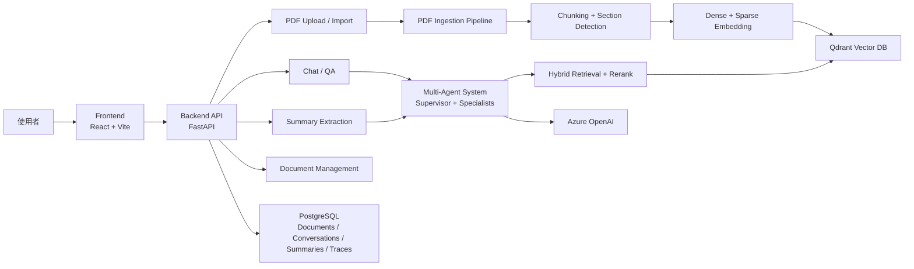

### 2.1 核心資料流

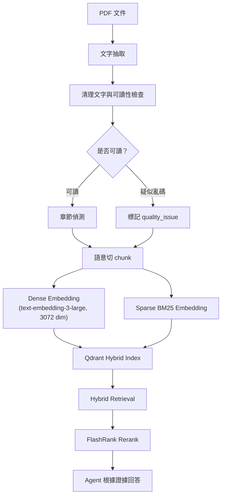

---

## 三、PDF 前處理 Pipeline

### 3.1 三解析器策略

研究報告 PDF 品質差異極大：文字型、公式密集型、掃描型都有。本系統不追求最高品質，而是「成本優先、品質補強」——先用本地端快速處理，再根據品質訊號決定是否升級。

| 轉換方式 | 優點 | 缺點 | 適合情境 | 成本 |
|---|---|---|---|---|
| 本地端 PyMuPDF4LLM | 快、免費、可批次大量、頁碼保留好 | 公式與複雜版面較弱，壞字型可能亂碼 | 大多數文字型研究報告、初次批次建索引 | 近乎零 |
| Azure Document Intelligence | 版面理解較好，OCR 穩定 | 圖片中抽出碎字，造成 chunk 噪音；需 Azure 額度 | 需要 OCR、表格或版面輔助辨識 | 依頁數計費 |
| LlamaParse | 公式、表格、學術 PDF 品質最好 | credit 限制、LLM token 成本與延遲高 | 公式密集、本地解析失敗、需高結構品質 | LlamaParse credit + LLM token |

**Cache priority（auto mode）**：`llamaparse > azure_di > pymupdf4llm`

同一份 PDF 可同時快取三個 parser 的結果，重新嵌入時直接選擇已有快取，不重複消耗額度。

### 3.2 Parser 決策流程

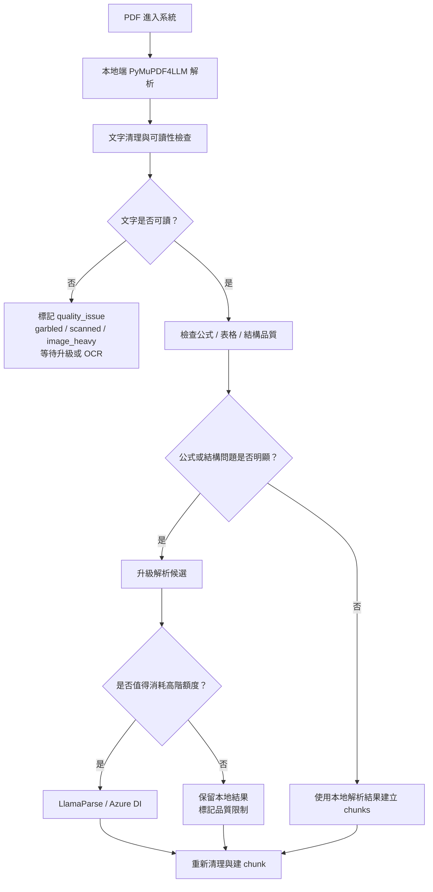

**設計取捨**：大量文件先用本地端避免雲端成本爆掉；只有真正需要品質的文件才升級；LlamaParse ghost page（`[0 x 0]`）自動重試最多 3 次，失敗 fallback 至 pymupdf4llm。

### 3.3 高階解析的節流設計

LlamaParse 效果最好，但不能無差別使用。系統先用品質訊號判斷是否值得升級：

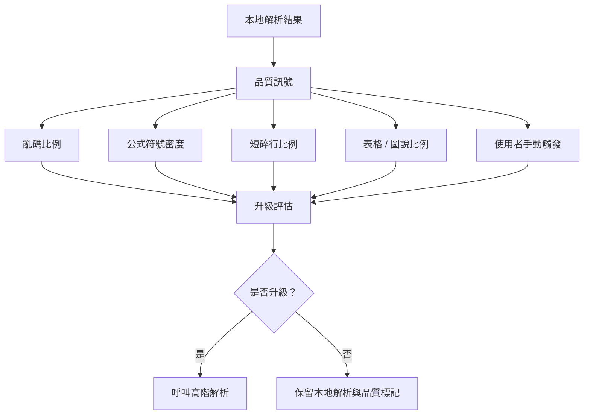

### 3.4 可讀性檢查

部分 PDF 雖可抽出文字，但內容是亂碼。系統估計可讀字元比例（CJK 字元 / ASCII 英數字 / 有效標點）：

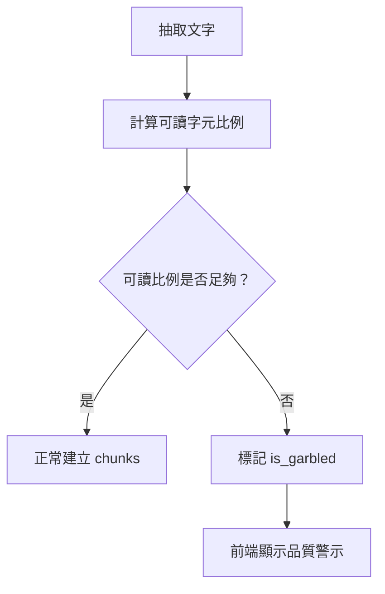

### 3.5 章節偵測策略

研究報告的章節格式不一致，採用多層 fallback：

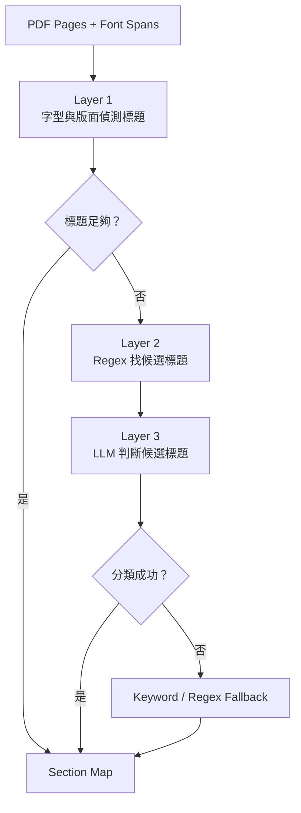

章節資訊附加在每個 chunk 的 metadata，讓 retrieval 能區分「方法節」與「結論節」，減少把前言當成果、把方法當限制的錯誤。

### 3.6 Chunk 策略

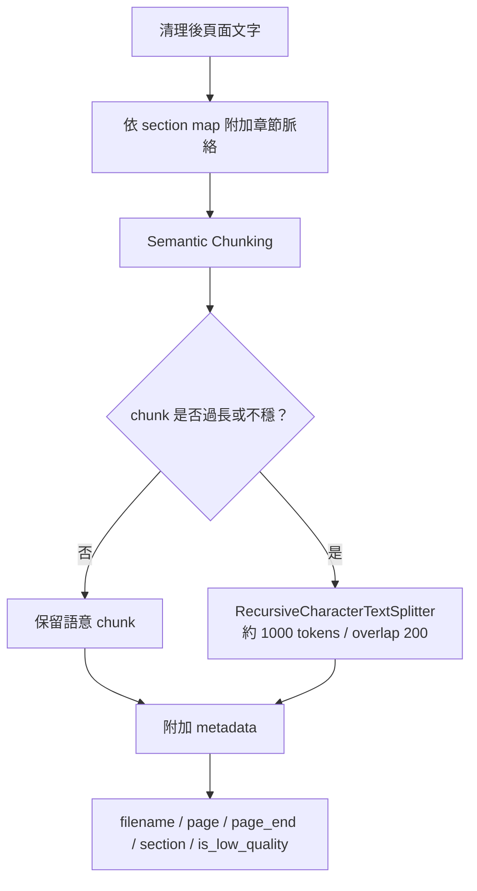

低品質片段（目錄 / 參考文獻 / 圖表殘片 / OCR 異常）標記 `is_low_quality=True`，retrieval 後由 reflector 過濾，不直接成為答案依據。

---

## 四、向量索引與混合檢索

### 4.1 為什麼用 Hybrid Search

研究報告含大量專有名詞（模型名、方法名、化合物名）：

- 只靠 dense search → 語意接近但漏掉精確術語
- 只靠 keyword search → 找到精確術語但漏掉語意相近段落
- Hybrid = dense + BM25 → 同時保留兩種能力

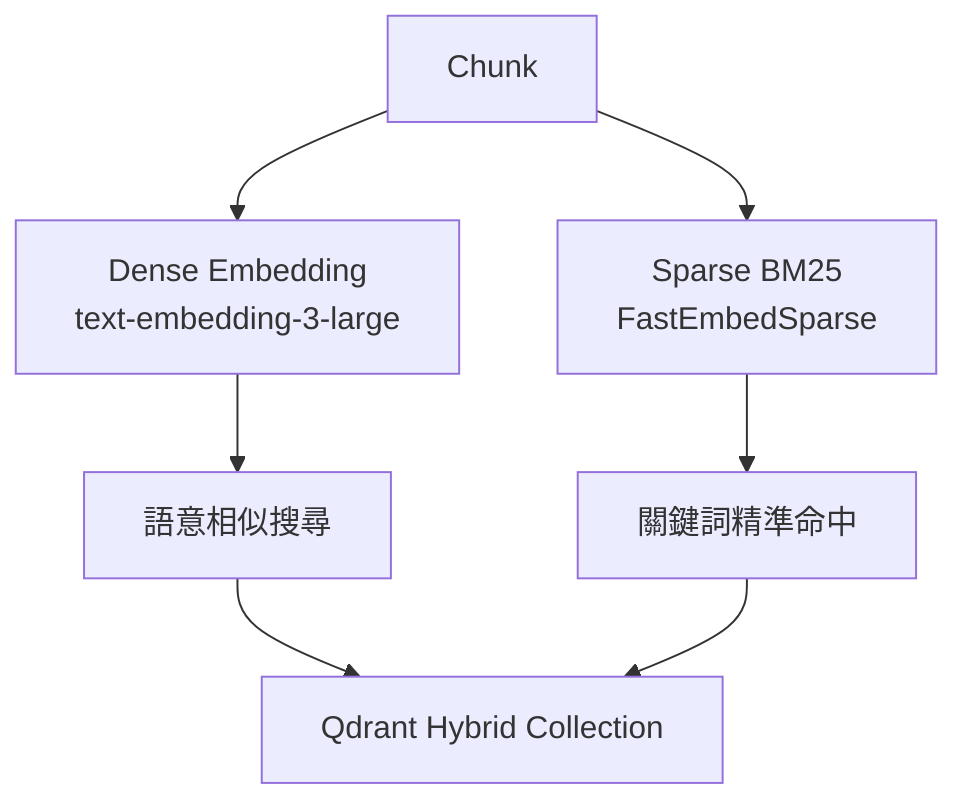

### 4.2 查詢增強流程

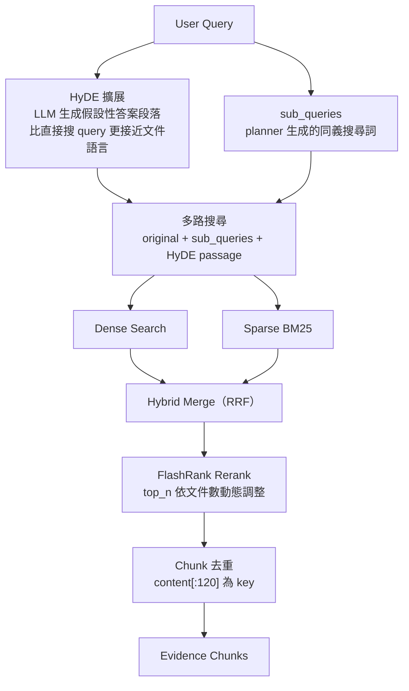

### 4.3 Chunk 品質與檢索品質控制

檢索不是拿到片段就直接相信：

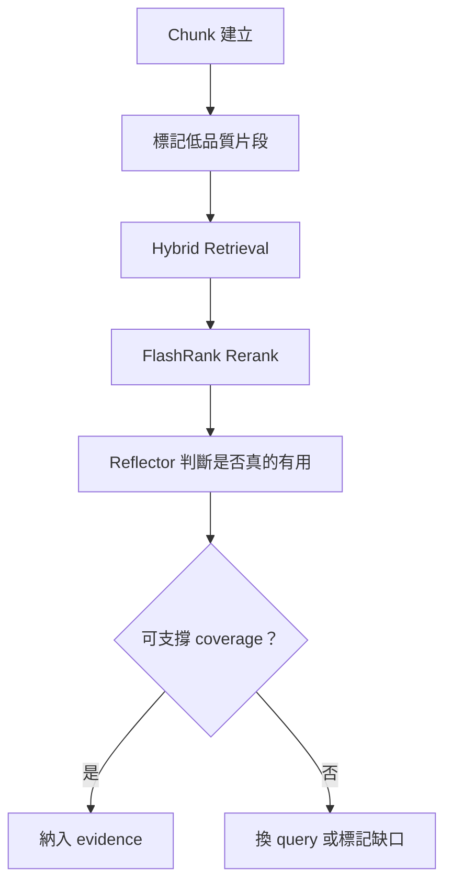

---

## 五、多代理人架構

### 5.1 設計演進：從聊天到研究任務

最初系統偏向一般 RAG 問答：

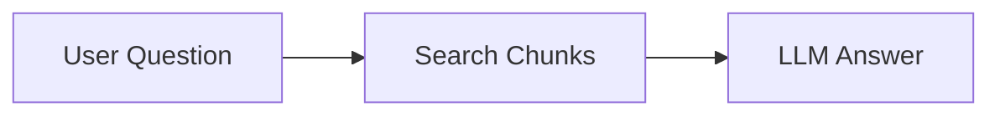

但研究摘要任務需要更完整的證據 coverage，因此演進成多階段研究流程：

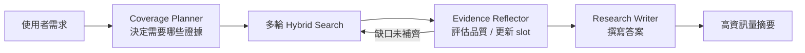

### 5.2 Supervisor 路由設計

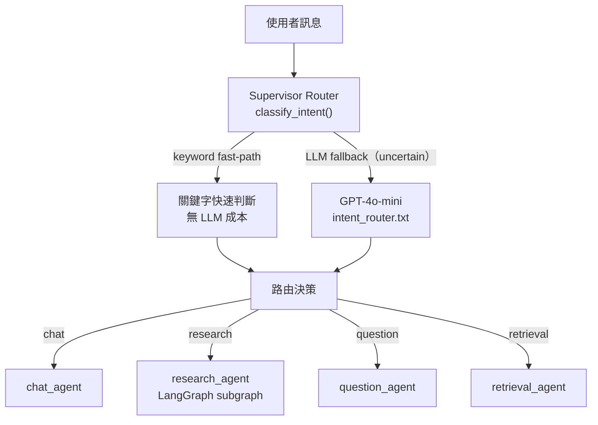

**Handoff 保護**：`MAX_HANDOFFS = 3`，超過上限強制 fallback 至 chat_agent，防止 ping-pong 迴圈。Agent 可透過 `AgentResult.next_intent` 主動委派，hop count 自動遞增。

### 5.3 Research Agent：LangGraph Subgraph

Research agent 不是手寫 while loop，而是標準 LangGraph `StateGraph`。每個步驟是獨立 node，由 conditional edges 控制流程：

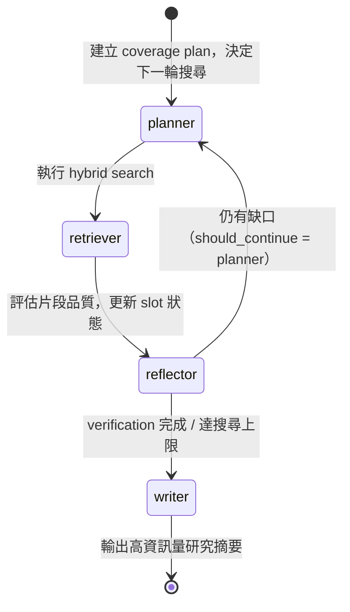

**Coverage Slots**（動態，可擴展）：

| Slot | 條件 | 說明 |
|------|------|------|
| motivation | required | 研究為什麼要做：問題背景、知識缺口、研究目的 |
| method | required | 研究如何進行：資料、方法、模型、流程、實驗 |
| results | required | 研究得到什麼：發現、分類、比較結果、貢獻或結論 |
| limitations | optional | 限制、不確定性、未完成事項、適用邊界 |

**停止條件**：

```
is_verification_search = True    → 驗證搜尋完成後直接寫答案
search_count ≥ max_searches      → 強制進入 writer（避免無限迴圈）
consecutive_no_new ≥ 2           → 標記 slot EXHAUSTED，重選缺口
```

相較舊版 while loop，LangGraph subgraph 帶來：LangSmith 每個 node 獨立子 trace、可 mid-run interrupt/resume、前端可透過 `astream` 逐步推送搜尋進度。

### 5.4 Prompt 分層架構

所有 agent 使用分層組合 prompt，不用單一大字串：

```
core.txt                  ← 所有 agent 共用：誠實性 / 語言 / 證據規則
retrieval_capability.txt  ← 搜尋策略 / 4-slot coverage / 品質判斷
chat_mode.txt             ← 對話互動方式
summary_mode.txt          ← 摘要提取規則
summary_quality.txt       ← 品質校正（空話偵測 / 方法成果混淆防護）
question_skill.txt        ← 導讀問答引導
question_generator.txt    ← 興趣量表生成
summary_structure.txt     ← 展示格式規則
```

每個 prompt 有 SHA-256 版本號，支援 `PROMPT_AB_TESTS` 環境變數進行版本對照實驗，版本比對與品質走勢可在 Trace Monitor 查看。

---

## 六、摘要產生 Pipeline

### 6.1 為什麼需要 Coverage Planner

直接問模型「請摘要這篇研究」容易出現：

- 只整理摘要頁，沒有進入正文
- 方法寫得太泛（「使用深度學習」，沒有說是哪個）
- 成果缺少數字或分類細節
- 限制被模型自己補出來而非文件原文

Coverage Planner 先決定要找哪些證據、要搜什麼，最後才寫答案，讓 raw summary 品質穩定後再交給格式化層。

### 6.2 三步驟架構

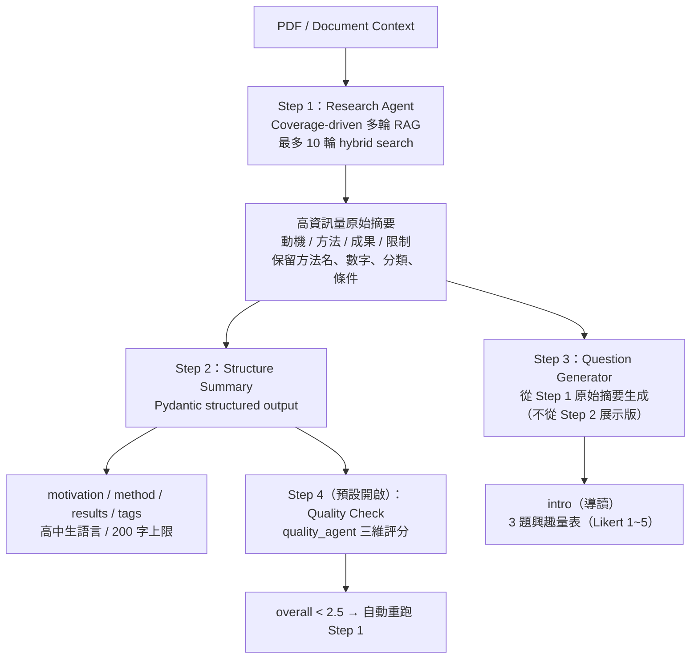

**分層的理由**：
- Step 1 只負責「補齊證據」，保留所有技術細節，不做格式化
- Step 2 只負責「高中生友善轉換」，不重新搜尋文件
- Step 3 從 Step 1 的高資訊量版本生成，避免細節已被 Step 2 壓縮
- Step 4 驗證品質，分數低就重跑 Step 1，而不是在展示層修補

### 6.3 誠實性設計

研究報告常不明確寫出限制：

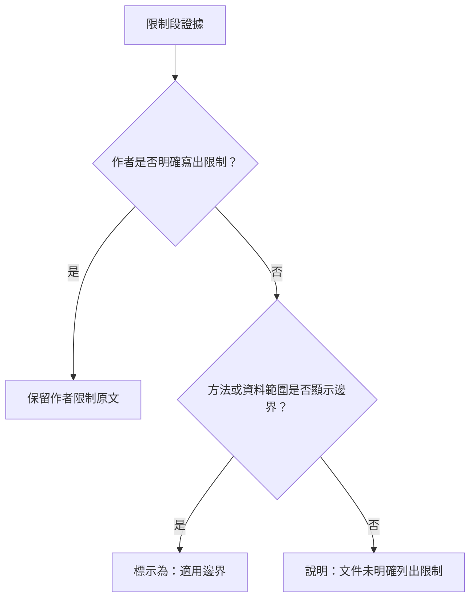

摘要與結論出現矛盾時，以結論 / 討論章節為準。不把模型推測寫成作者結論。

---

## 七、設計亮點

### 7.1 任務導向取代單次問答

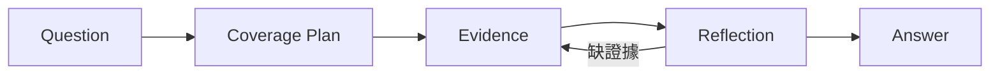

不先問「答案是什麼」，而先問「需要哪些證據才能回答」。

### 7.2 摘要與展示分層

將摘要流程拆成三層，好處是每層 prompt 可以獨立調整，不互相牽制：

- **研究層（Step 1）**：負責證據完整性，偏高資訊量，保留方法名 / 數字 / 分類
- **展示層（Step 2）**：負責可讀性，偏學生理解，白話解釋術語
- **導讀層（Step 3）**：負責興趣探索，偏學習體驗，用 1~5 分作答的量表題

### 7.3 PDF 到 Evidence 的可控轉換

PDF RAG 的難點不只在 LLM，而在「能不能把文件轉成好證據」：

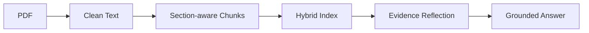

每個環節都有品質控制，不是「拿到什麼就直接相信」。

### 7.4 解析品質與成本的平衡

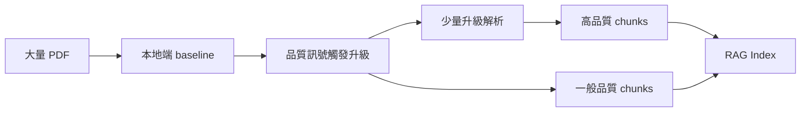

### 7.5 學生導向輸出

系統服務的不只是研究者，也包含探索科系方向的高中生。他們需要的不是論文式摘要或考題，而是：

- 這個研究在解決什麼問題
- 研究者是怎麼思考的
- 我會不會喜歡這種研究方式

Step 3 的興趣量表：每題 70~100 字，先鋪陳 2~4 句情境再提問，調性依學科調整（數學強調邏輯優雅、工程強調實作成就感、文學強調跨時代共鳴）。

---

## 八、模組設計

### 8.1 Backend

- **`rag.py`**：PDF 解析、清理、section detection、chunk、embedding 寫入 Qdrant、hybrid retrieval + rerank
- **`agents/research_graph.py`**：LangGraph subgraph（planner / retriever / reflector / writer 4 nodes）
- **`agents/main_agent.py`**：Supervisor Router，keyword fast-path + LLM fallback + handoff guard
- **`extraction.py`**：批次摘要 Step 1~4 流程
- **`prompting/registry.py`**：Prompt SHA-256 版本、AB testing、ALIASES
- **`agents/quality_agent.py`**：三維 0-5 分品質評估
- **`api/traces.py`**：Trace Monitor API（timeline / compare / batch-score / test-route / eval）

### 8.2 Frontend

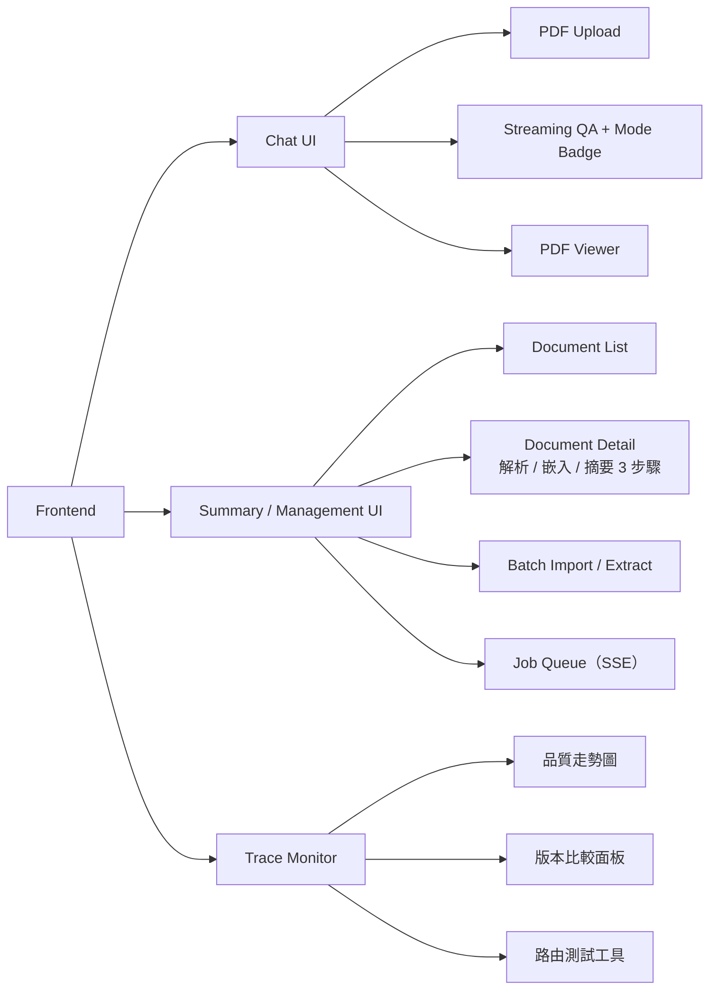

### 8.3 資料儲存設計

```mermaid
erDiagram
    DOCUMENT {
        int id
        string filename
        string status
        string batch_status
        json summary_json
        string department_hint
        text abstract_text
        string quality_issue
        string parser_used
    }

    TRACE {
        string run_id
        string mode
        string agent_name
        string prompt_name
        string prompt_version
        float quality_score
        text display
        int tool_count
        int llm_call_count
    }

    CONVERSATION {
        int id
        string title
        datetime created_at
    }

    DOCUMENT ||--o{ TRACE : referenced_by
    CONVERSATION ||--o{ TRACE : contains
```

---

## 九、關鍵技術

| 類別 | 技術 |
|---|---|
| Backend | FastAPI + Python 3.11 |
| Frontend | React 19 + TypeScript + Vite |
| Agent Orchestration | LangGraph（StateGraph + conditional edges） |
| LLM | Azure OpenAI GPT-4o / GPT-4o-mini |
| Embedding | Azure OpenAI text-embedding-3-large（3,072 維） |
| Vector DB | Qdrant（Dense + Sparse BM25 Hybrid） |
| Reranking | FlashRank |
| Query Expansion | HyDE（Hypothetical Document Embeddings） |
| PDF Parsing | PyMuPDF4LLM / Azure Document Intelligence / LlamaParse |
| Prompt Management | 分層 Stack 系統（SHA-256 版本 / AB testing） |
| Database | PostgreSQL（SQLAlchemy + AsyncPostgresSaver） |
| Tracing | LocalTracer（LangChain callback → PostgreSQL） |
| Quality Eval | 三維 quality_agent + Eval dataset |

---

## 十、目前挑戰

1. **PDF 品質不穩**：掃描型 / 壞字型 / 公式密集型三類問題各不同，三解析器互補但成本控管仍需優化
2. **章節格式差異極大**：不同報告的章節命名與結構差異大，多層 fallback 仍有失效案例
3. **摘要容易過度壓縮**：展示層若太追求簡短，會丟失研究變因與數字
4. **限制段容易被模型腦補**：需要 prompt 明確限制推論範圍
5. **跨領域摘要標準不一**：工程、文學、商管所需的「完整」定義不同
6. **Reflector 空輸出**：`with_structured_output` 與系統提示 JSON schema 說明衝突，已修正（移除 schema 範例、加 strict=True、exception logging）

---

## 十一、未來規劃

**短期**
- Research graph 串流：`research_graph.astream()` 逐步推送每輪搜尋進度到前端
- Coverage items 動態化：由 task_planner 根據問題類型產生客製化 coverage slots
- Eval set 持續擴充 + Prompt 持續優化

**中期**
- OCR fallback：亂碼 PDF 自動升級解析流程
- `find_related_documents` 工具：語意搜尋語料庫中的相關研究
- 跨文件比較：同系所 / 同主題 / 不同年度報告

**長期**
- 研究主題地圖：自動整理各系研究方向
- 學生探索推薦：根據興趣題結果推薦相關研究
- 多文件 coverage：單次研究任務跨多份 PDF 補齊證據

---

## 十二、系統總結

本系統把 PDF 研究報告從「靜態文件」轉成「可探索的研究知識」：

```mermaid
flowchart LR
    A["PDF 文件"] --> B["RAG 檢索"]
    B --> C["Coverage-driven Research Agent"]
    C --> D["高資訊量摘要"]
    D --> E["學生友善展示"]
    D --> F["導讀與興趣探索"]
```

最重要的設計取捨：

- 用多輪 evidence coverage 取代一次性摘要
- 用 Step 1 / Step 2 / Step 3 分層降低幻覺
- 用保守限制處理維持回答可信度
- 用 LangGraph StateGraph 讓研究流程可觀測、可中斷、可恢復

---

## 參考資料

- [LangGraph Multi-Agent Architectures](https://langchain-ai.github.io/langgraph/concepts/multi_agent/)
- [Benchmarking Multi-Agent Architectures — LangChain Blog](https://www.langchain.com/blog/benchmarking-multi-agent-architectures)
- [HyDE: Precise Zero-Shot Dense Retrieval without Relevance Labels](https://arxiv.org/abs/2212.10496)
- [FlashRank: Ultra-lite & Super-fast Python library for re-ranking](https://github.com/PrithivirajDamodaran/FlashRank)
- [LlamaParse: GenAI-native document parser](https://github.com/run-llama/llama_parse)

**資料來源**：國家科學與技術委員會 — 大專學生研究計畫
https://wsts.nstc.gov.tw/STSWeb/Award/AwardMultiQuery.aspx
