# 研究報告 AI 導讀與摘要系統

## RAG-based PDF Research Assistant

---

### 1. 專案背景

大專生研究計畫報告通常具有以下特性：

- PDF 數量多、主題分散
- 文件長度不一，章節結構不穩定
- 研究動機、方法、成果、限制常散落在不同頁面
- 使用者多半不是該領域專家，需要先被「導讀」
- 單純全文摘要容易遺漏方法、數據、限制與研究脈絡

本系統的目標是讓使用者能快速理解一份研究報告：

- 這篇研究在問什麼？
- 它怎麼做？
- 它發現了什麼？
- 有哪些限制？
- 高中生是否會對這類研究方向感興趣？

---

### 2. 系統目標

本系統不是單純 PDF 聊天機器人，而是研究文件分析助手。

核心目標：

1. **文件理解**
   - 從 PDF 中抽取研究脈絡與證據
   - 支援研究動機、方法、結果、限制等高資訊量摘要

2. **證據導向**
   - 所有回答盡量根據文件片段
   - 不憑模型記憶補充文件沒有寫的內容

3. **學生友善**
   - 將學術語言轉成高中生可理解的內容
   - 產生導讀與興趣量表題，協助探索研究方向

4. **批次處理**
   - 可批量匯入多份 PDF
   - 自動產生結構化摘要與標籤

---

### 3. 整體架構

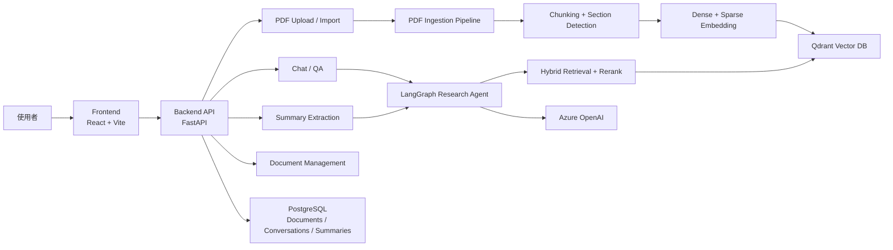

---

### 4. 核心資料流

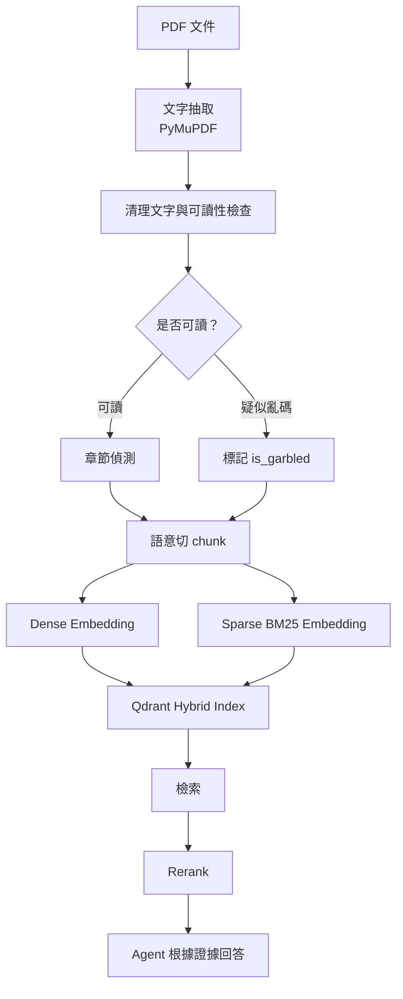

---

### 5. PDF 轉換與前處理策略

PDF 不是直接丟給模型，而是先轉成可檢索、可追蹤、可分段的文字資料。

目前 PDF 轉換設計採用「成本優先、品質補強」策略：

1. 預設先跑本地端轉換
2. 若偵測到公式、版面或可讀性問題，再升級處理
3. 對公式密集、表格複雜或本地抽取失敗的文件，優先考慮 LlamaParse + LLM
4. Azure Document Intelligence 可作為補充方案，但需注意成本與圖片碎字問題

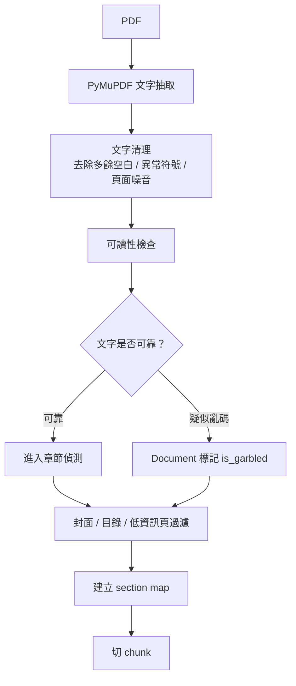

設計重點：

- 使用 PyMuPDF 取得頁面文字與字型資訊
- 先清理文字，再進行章節與 chunk 判斷
- 若 PDF 字型編碼壞掉，系統不假裝正常，而是標記 `is_garbled`
- 封面、目錄、低資訊頁盡量不進入主要檢索內容

---

### 6. PDF 轉換方案比較

| 轉換方式 | 優點 | 缺點 | 適合情境 | 成本考量 |
|---|---|---|---|---|
| 本地端 PyMuPDF | 快、免費、可批次大量處理、容易保留頁碼 | 公式與複雜版面表現較弱，遇到壞字型可能亂碼 | 大多數文字型研究報告、初次批次建索引 | 幾乎無額外成本 |
| Azure Document Intelligence | 版面理解能力較好，公式表現尚可，雲端服務穩定 | 容易從圖片中抽出大量單字或碎字，造成 chunk 噪音；需消耗 Azure 額度 | 需要 OCR、表格或版面輔助辨識的文件 | 依頁數與服務用量計費 |
| LlamaParse + LLM | 整體解析品質最好，對公式、表格、學術 PDF 較友善；串接 LLM 後複雜版面理解更穩 | 有 credit 限制，且會增加 LLM token 成本與延遲，不適合無差別全量跑 | 公式密集、本地解析失敗、需要較高結構品質的文件 | LlamaParse credit + LLM token 成本，需節制使用 |

---

### 7. PDF 轉換決策流程

系統不一開始就使用最高成本方案，而是先用低成本方法處理，再根據品質訊號決定是否升級。

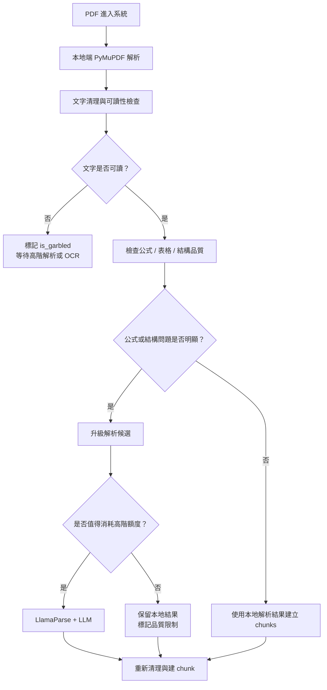

設計取捨：

- 大量文件先用本地端處理，避免雲端成本爆掉
- 只有在本地端明顯處理不好時才升級
- LlamaParse + LLM 用在最需要品質的文件，而不是所有文件
- 若高階解析仍有限制，保留品質標記，避免後續模型過度相信

---

### 8. 公式與複雜版面的處理策略

研究報告中常見：

- 數學公式
- 工程模型
- 表格
- 圖說
- 掃描圖片
- 多欄排版

不同轉換方式對這些內容的表現不同。

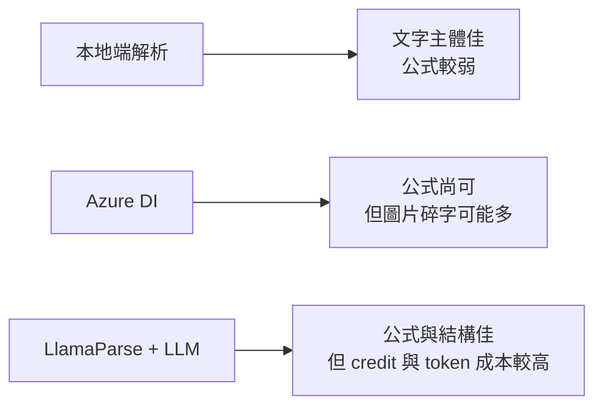

目前策略：

- 文字型文件：優先使用本地端
- 公式密集文件：若本地端結果破碎，再考慮 LlamaParse + LLM
- 圖片型 PDF：先標記品質問題，不直接假裝解析正常
- 表格與圖說：盡量保留頁碼與 section，避免模型把碎片當結論

---

### 9. 高階解析的節流設計

LlamaParse + LLM 效果最好，但不能無限制使用。

因此系統設計上可以加入「升級條件」：

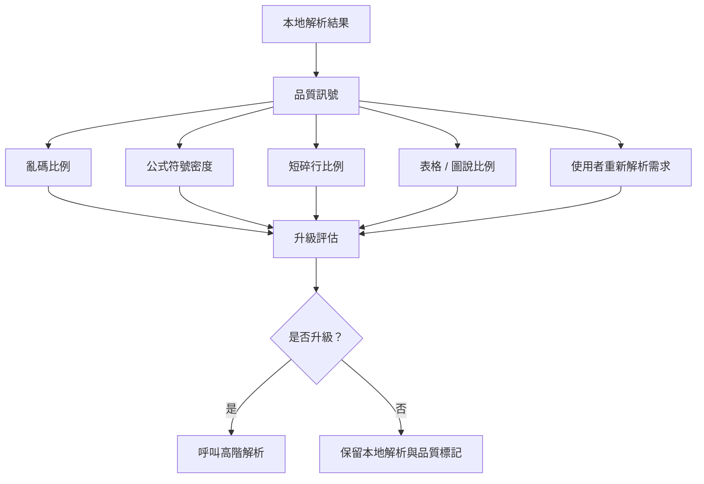

設計巧思：

- **先便宜後昂貴**：大多數文件先用本地端快速處理
- **用品質訊號觸發升級**：不是手動猜哪份文件需要高階解析
- **保留解析來源 metadata**：後續可知道 chunk 來自本地、Azure DI 或 LlamaParse + LLM
- **避免重複花費**：同一份 PDF 的高階解析結果可快取，重新建索引時不必重新消耗額度、credit 或 LLM token
- **可人工覆寫**：使用者若發現某份文件摘要很差，可以指定重新解析

---

### 10. LlamaParse + LLM 的升級使用策略

若直接把所有 PDF 全部送進 LlamaParse，credit 消耗會很快；若再串接 LLM 輔助解析，成本與延遲也會進一步增加。

因此 LlamaParse + LLM 應被視為「最高品質但最高成本」的升級路徑，而不是預設流程。

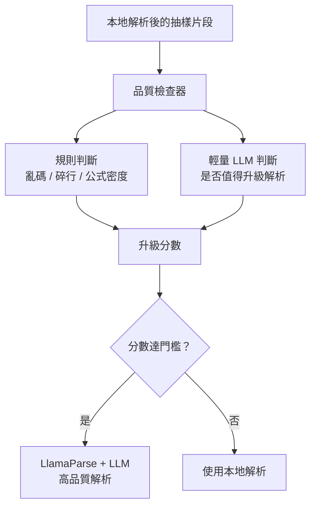

這樣的好處：

- 輕量 LLM 先判斷是否值得升級，避免直接全量跑高階解析
- 只有真的影響理解的文件才使用 LlamaParse + LLM
- 可以避免因少量公式或圖片就過度消耗 credit
- 解析決策可被記錄，方便後續調整門檻

設計取捨：

- 本地端解析負責大量 baseline
- 輕量 LLM 只協助判斷是否升級
- LlamaParse + LLM 用於少量高難度 PDF
- 高階解析結果需要快取，避免重複消耗 credit 與 token

---

### 11. PDF 可讀性檢查

部分 PDF 雖然可以抽出文字，但內容可能是亂碼。

系統會估計可讀字元比例：

- CJK 字元
- ASCII 英數字
- 有效標點與正常文本結構

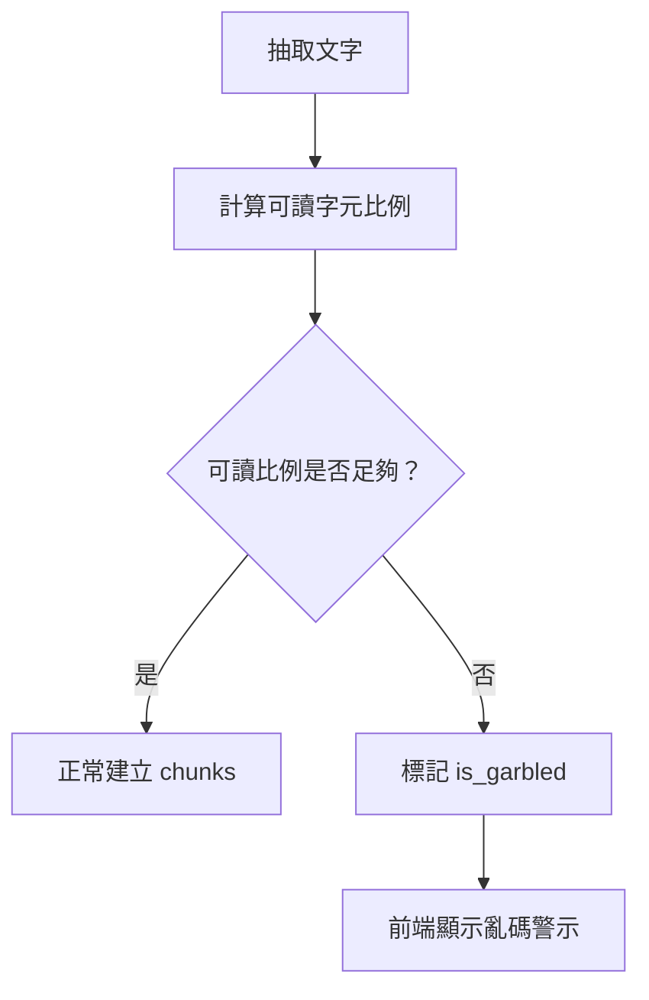

目的：

- 避免把亂碼 chunk 當成可信證據
- 讓使用者知道該 PDF 可能需要 OCR 或人工檢查
- 為未來 OCR fallback 保留擴充點

---

### 12. 章節偵測策略

研究報告的章節格式不一致，因此採用多層 fallback。

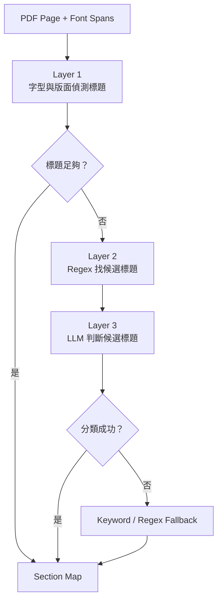

章節偵測會優先利用：

- 字體大小
- 粗體特徵
- 章節編號
- 常見章節詞，例如緒論、研究方法、結果、結論
- LLM 輔助判斷候選標題

設計目的：

- 讓 chunk 保留所在章節脈絡
- 幫助 retrieval 判斷片段來自方法、結果或結論
- 減少摘要時誤把前言當成果、把方法當限制

---

### 13. Chunk 策略

本系統不是單純固定長度切割，而是結合語意切分與保底切分。

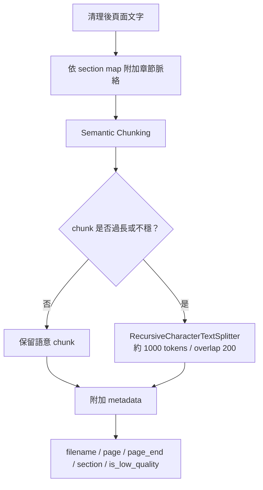

Chunk metadata 會保留：

- 文件名稱
- 起始頁與結束頁
- 所屬章節
- 是否低品質
- 原始片段內容

這些 metadata 會在回答時用來提供來源與判斷證據品質。

---

### 14. 為什麼不用單純固定切 chunk

固定切 chunk 的問題：

- 可能把同一段方法切斷
- 可能把表格、圖說、正文混在一起
- 可能失去章節脈絡
- 摘要時容易不知道片段是背景、方法還是結論

目前策略：

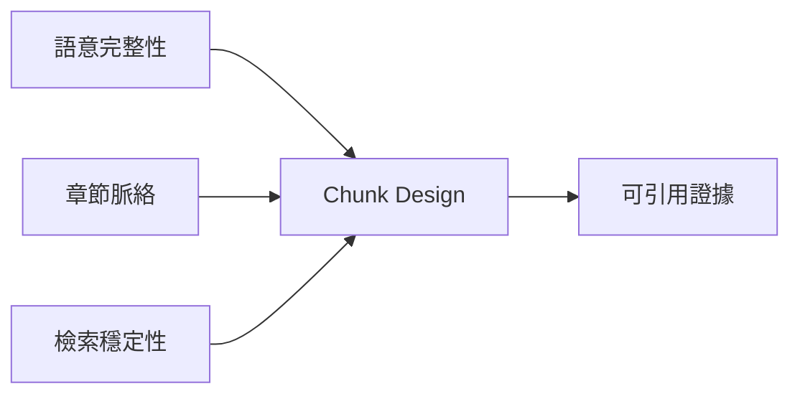

取捨：

- 語意切分讓段落比較自然
- recursive fallback 避免 chunk 過長
- overlap 保留跨段上下文
- metadata 補足檢索與來源追蹤

---

### 15. 向量化與索引策略

每個 chunk 會建立兩種檢索訊號：

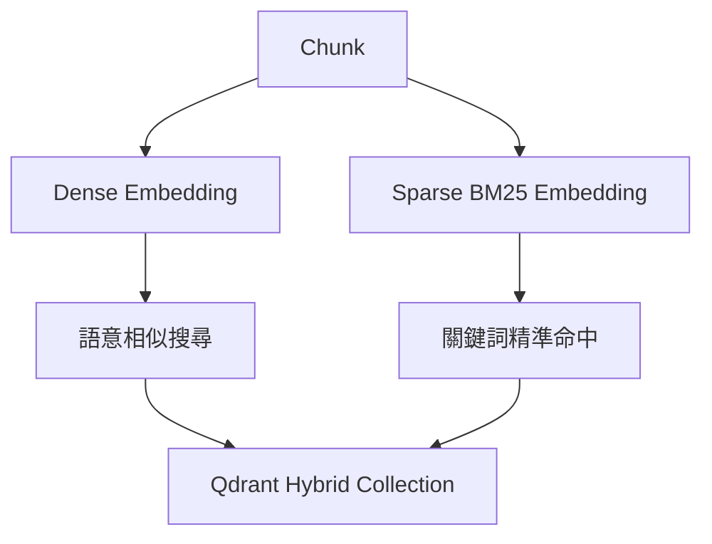

設計原因：

- 研究報告有大量專有名詞、模型名、方法名
- 只靠 dense search 可能漏掉精確術語
- 只靠 keyword search 又容易漏掉語意相近段落
- hybrid search 同時保留語意與關鍵詞能力

---

### 16. Chunk 品質與檢索品質控制

檢索不是拿到片段就直接相信。

系統會在多個階段控制品質：

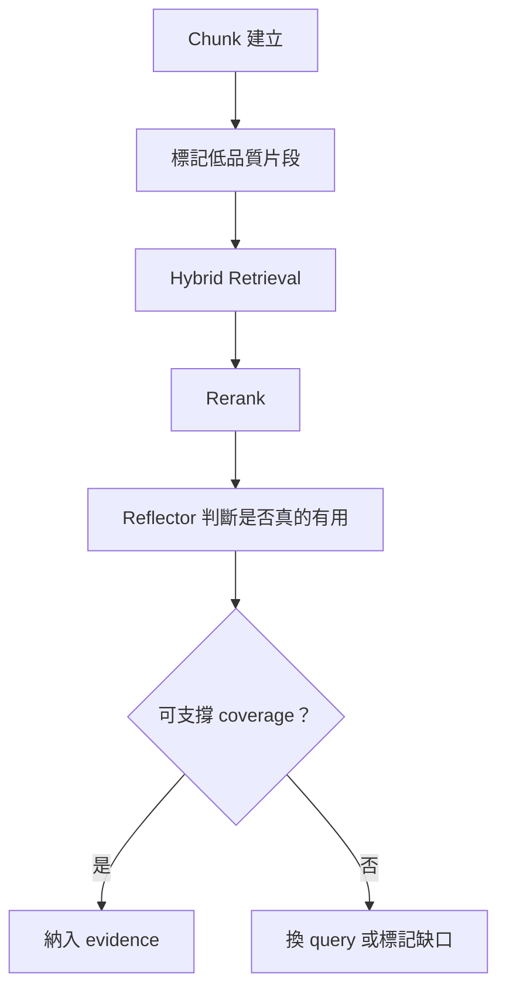

低品質片段可能包含：

- 目錄
- 參考文獻
- 圖表殘片
- 孤立頁碼
- OCR / 字型抽取異常內容

這些片段即使被搜尋到，也不應直接變成答案依據。

---

### 17. Backend 模組設計

主要模組：

- `main.py`
  - FastAPI 入口
  - 文件、對話、摘要、任務 API
  - 啟動時建立資料表

- `rag.py`
  - PDF 載入
  - 清理與切 chunk
  - section detection
  - embedding 與 Qdrant 寫入
  - hybrid retrieval + rerank

- `agent.py`
  - 聊天型 ReAct Agent
  - 使用 `search_report` 工具搜尋文件

- `extraction.py`
  - 批次摘要流程
  - Step1：研究型多輪檢索摘要
  - Step2：結構化摘要
  - Step3：學生導讀與興趣題

- `database.py`
  - 文件 metadata
  - 對話紀錄
  - 摘要結果
  - 批次處理狀態

---

### 18. Frontend 模組設計

前端分成兩大使用情境：

1. **聊天 / 問答介面**
   - 上傳或選擇 PDF
   - 與文件進行問答
   - 顯示 PDF 預覽

2. **摘要 / 文件管理介面**
   - 文件列表
   - 批次匯入
   - 批次摘要
   - 查看摘要、標籤、abstract
   - 查看 chunk 內容

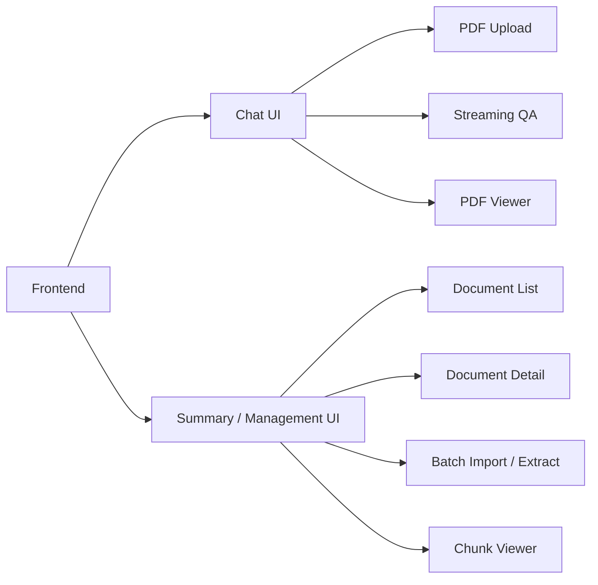

---

### 19. 設計演進：從聊天到研究任務

最初系統偏向一般 RAG 問答：

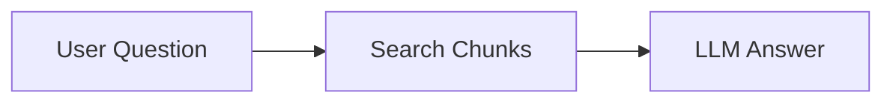

但研究摘要任務需要更完整的證據 coverage。

因此演進成多階段研究流程：

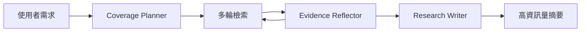

---

### 20. 為什麼需要 Coverage Planner

直接問模型「請摘要這篇研究」容易出現：

- 只整理摘要頁，沒有進入正文
- 方法寫得太泛
- 成果缺少數字或分類
- 限制被模型自己補出來
- 不同任務都套同一個摘要格式

Coverage Planner 的任務是先決定：

- 這次任務需要哪些證據？
- 每個證據項目要搜什麼？
- 最後答案應該長什麼樣子？

---

### 21. Research Agent 運行流程

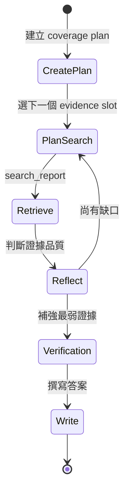

---

### 22. 摘要產生 Pipeline

目前摘要不是一步完成，而是分成三層：

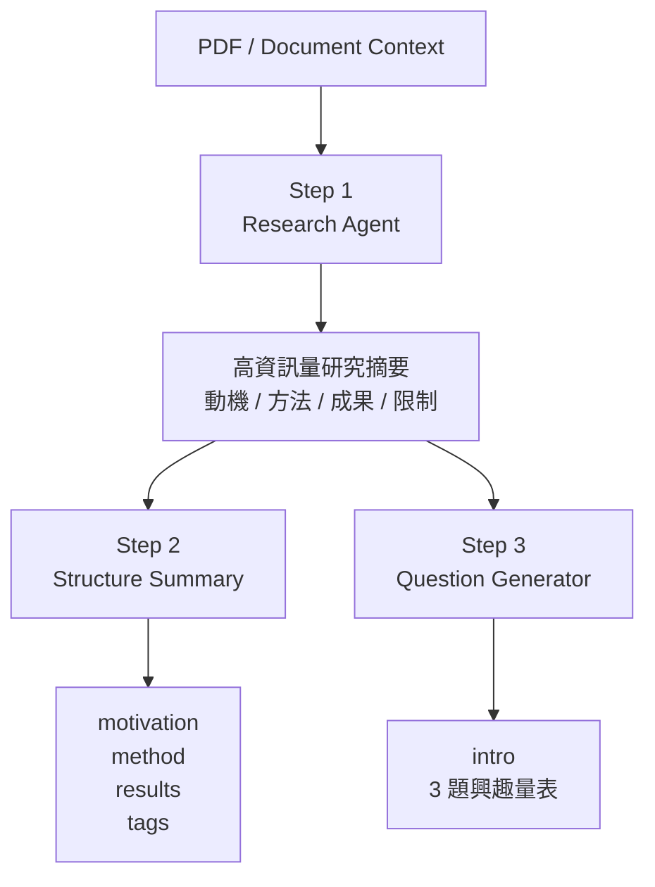

設計重點：

- Step1 負責「補齊證據」
- Step2 負責「展示格式」
- Step3 負責「學生導讀與興趣探索」

---

### 23. Step1：高資訊量研究摘要

Step1 是最關鍵的一層。

它要做到：

- 搜尋研究動機、方法、成果、限制
- 保留文件中的方法名、模型名、分類、數字、條件
- 不把推測寫成事實
- 若文件沒有明確限制，要明說
- 避免只輸出四句短摘要

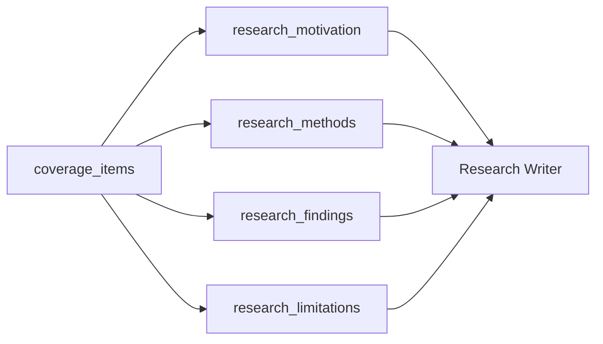

---

### 24. Step2：結構化展示摘要

Step2 的任務不是重新研究，而是把 Step1 改寫成前端可展示的欄位：

- `motivation`
- `method`
- `results`
- `tags`

設計原則：

- 保留 Step1 的重點
- 使用高中生能理解的語言
- 專業名詞第一次出現時補白話說明
- 不新增 Step1 沒有的內容
- 結果與限制不能只保留正面說法

---

### 25. Step3：導讀與興趣量表

Step3 用於幫助學生判斷是否對研究方向有興趣。

輸出：

- `intro`
  - 120 到 220 字
  - 讓學生知道這個研究在看什麼
  - 帶出研究內容感

- `questions`
  - 3 題興趣量表
  - 每題可用 1 到 5 分回答
  - 不考知識，而是探索興趣

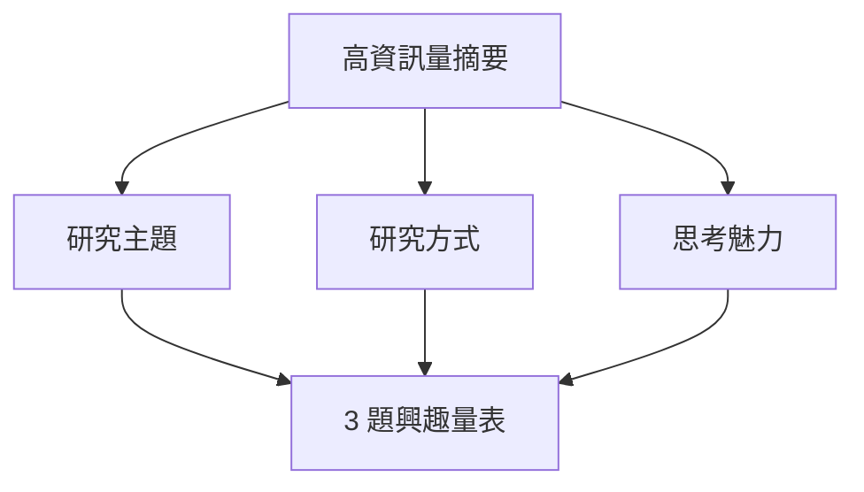

---

### 26. RAG 檢索策略

本系統使用 hybrid retrieval：

```mermaid
flowchart LR
    Query["Query"] --> Dense["Dense Vector Search"]
    Query --> Sparse["Sparse BM25 Search"]

    Dense --> Merge["Hybrid Merge"]
    Sparse --> Merge

    Merge --> Rerank["FlashRank Rerank"]
    Rerank --> TopK["Top Evidence Chunks"]
```

優點：

- Dense search 找語意相近內容
- Sparse search 保留關鍵詞命中能力
- Rerank 提升最後片段品質
- 適合研究文件中方法名、模型名、專有術語很多的情境

---

### 27. Section Detection 設計補充

研究報告的 PDF 章節格式不穩定，因此 section detection 使用多層 fallback。

這裡是簡化版流程：

```mermaid
flowchart TD
    A["PDF Pages"] --> B["Font-based Heading Detection"]
    B --> C{"有足夠章節？"}

    C -->|"是"| Z["Section Map"]
    C -->|"否"| D["Regex Candidate Headings"]

    D --> E["LLM Heading Classification"]
    E --> F{"分類成功？"}

    F -->|"是"| Z
    F -->|"否"| G["Keyword / Regex Fallback"]
    G --> Z
```

設計目的：

- 盡量讓 chunk 保留章節脈絡
- 區分 introduction / methods / results 等段落
- 提升摘要與檢索精度

---

### 28. 資料儲存設計

```mermaid
erDiagram
    DOCUMENT {
        int id
        string filename
        string file_path
        string status
        string batch_status
        json summary_json
        string category
        string tags
        string department_hint
        string abstract_text
        boolean is_garbled
    }

    CONVERSATION {
        int id
        string title
        datetime created_at
    }

    MESSAGE {
        int id
        int conversation_id
        string role
        text content
        datetime created_at
    }

    DOCUMENT ||--o{ MESSAGE : referenced_by
    CONVERSATION ||--o{ MESSAGE : contains
```

---

### 29. 關鍵技術

| 類別 | 技術 |
|---|---|
| Backend | FastAPI |
| Frontend | React + TypeScript + Vite |
| Agent Orchestration | LangGraph |
| LLM | Azure OpenAI GPT-4o |
| Embedding | Azure OpenAI Embeddings |
| Vector DB | Qdrant |
| Retrieval | Hybrid Dense + Sparse |
| Reranking | FlashRank |
| PDF Parsing | PyMuPDF |
| Advanced Parsing | Azure Document Intelligence / LlamaParse + LLM |
| Database | PostgreSQL |
| Batch Jobs | Background task + SSE |

---

### 30. 設計亮點一：任務導向而非單次問答

傳統 RAG：

- 問一次
- 搜一次
- 答一次

本系統：

- 先理解任務需要哪些證據
- 逐步補齊 coverage
- 反思目前證據是否足夠
- 最後才寫答案

```mermaid
flowchart LR
    A["Question"] --> B["Coverage"]
    B --> C["Evidence"]
    C --> D["Reflection"]
    D --> E["Answer"]

    D -->|"缺證據"| C
```

---

### 31. 設計亮點二：摘要與展示分層

將摘要流程拆成：

1. **研究層**
   - 負責證據完整性
   - 偏高資訊量

2. **展示層**
   - 負責可讀性
   - 偏學生理解

3. **導讀層**
   - 負責興趣探索
   - 偏學習體驗

好處：

- 不讓導讀模型重新編資料
- 不讓展示摘要犧牲原始證據
- 每一層 prompt 可以獨立調整

---

### 32. 設計亮點三：誠實性與限制處理

研究報告常不會明確寫出限制。

因此系統要求：

- 文件有明確限制：保留
- 文件沒有明確限制：明說沒有
- 只能從方法或資料範圍看出邊界：標示為「適用邊界」
- 不把模型推測寫成作者結論

```mermaid
flowchart TD
    A["限制段證據"] --> B{"文件是否明確寫出限制？"}
    B -->|"是"| C["保留作者限制"]
    B -->|"否"| D{"方法或資料範圍是否顯示邊界？"}
    D -->|"是"| E["標示為適用邊界"]
    D -->|"否"| F["說明文件未明確列出限制"]
```

---

### 33. 設計亮點四：學生導向輸出

系統最終不是只服務研究者，也服務正在探索科系與研究方向的學生。

學生需要的不是：

- 論文式長摘要
- 過多術語
- 死背型考題

而是：

- 這個研究在看什麼問題
- 研究者怎麼思考
- 我會不會喜歡這種研究方式
- 這個領域的工作感是什麼

---

### 34. 設計亮點五：PDF 到 Evidence 的可控轉換

PDF RAG 的難點不只在 LLM，而在「能不能把文件轉成好證據」。

本系統的設計亮點：

- 先判斷文字是否可靠，再進入檢索
- 章節偵測使用多層 fallback
- chunk 同時考慮語意、長度與章節脈絡
- metadata 保留頁碼、章節、品質標記
- retrieval 後還有 rerank 與 reflector 檢查

```mermaid
flowchart LR
    A["PDF"] --> B["Clean Text"]
    B --> C["Section-aware Chunks"]
    C --> D["Hybrid Index"]
    D --> E["Evidence Reflection"]
    E --> F["Grounded Answer"]
```

這讓系統不是只「能搜到文字」，而是更接近「能管理證據品質」。

---

### 35. 設計亮點六：解析品質與成本的平衡

PDF 解析不是單純追求最高品質，還要考慮批次處理成本。

本系統的策略是：

- 本地端處理作為 baseline
- 用品質檢查找出需要升級的文件
- 高階 parser 用在少數真正需要的文件
- 保留 parser 來源與品質標記，讓後續摘要知道證據可信度

```mermaid
flowchart LR
    A["大量 PDF"] --> B["本地端 baseline"]
    B --> C["品質檢查"]
    C --> D["少量升級解析"]
    D --> E["高品質 chunks"]
    C --> F["一般品質 chunks"]
    E --> G["RAG Index"]
    F --> G
```

這個設計讓系統可以同時兼顧：

- 成本
- 速度
- 公式與版面品質
- 批次處理能力
- 後續回答可信度

---

### 36. 目前挑戰

1. **PDF 品質不穩**
   - 有些 PDF 文字抽取會亂碼
   - 圖表型內容不容易被完整理解
   - 公式密集文件需要更好的解析策略

2. **章節格式差異大**
   - 不同報告的章節命名不一致
   - 有些方法與結果散落在多處

3. **摘要容易過度壓縮**
   - 展示層若太追求短，會丟失研究變因與數字

4. **限制段容易被模型腦補**
   - 需要 prompt 明確限制推論範圍

5. **跨領域摘要難度高**
   - 工程、文學、教育、管理、AI 報告需要不同重點

6. **解析成本控管**
   - 高階 parser 品質較好，但不適合全量使用
   - 需要更穩定的升級判斷與快取策略

---

### 37. 未來規劃

短期：

- 建立小型 eval set
  - 不同領域各挑數篇
  - 檢查方法、成果、限制是否完整
- 持續調整 prompt
  - 保留數字與方向性
  - 減少泛化與腦補
- 改善 chunk viewer
  - 方便人工檢查檢索片段品質

中期：

- OCR fallback
  - 處理亂碼 PDF
- Parser escalation
  - 本地解析失敗或公式密集時，自動升級到高階 parser
- Parser cache
  - 避免同一文件重複消耗雲端額度或 credit
- 更細緻的章節分類
  - introduction / method / result / discussion / conclusion
- 摘要品質評分
  - 檢查是否有方法、變因、結果、限制

長期：

- 多文件比較
  - 同系所、同主題、不同年度比較
- 研究主題地圖
  - 自動整理各系研究方向
- 學生探索推薦
  - 根據興趣題結果推薦相關研究報告

---

### 38. 系統價值

本系統把 PDF 研究報告從「靜態文件」轉成「可探索的研究知識」。

它不只回答問題，也協助使用者：

- 快速理解研究內容
- 找到文件證據
- 看懂研究方法
- 掌握成果與限制
- 判斷自己是否對該研究方向有興趣

---

### 39. 總結

本專案的核心設計是：

```mermaid
flowchart LR
    A["PDF 文件"] --> B["RAG 檢索"]
    B --> C["Coverage-driven Research Agent"]
    C --> D["高資訊量摘要"]
    D --> E["學生友善展示"]
    D --> F["導讀與興趣探索"]
```

最重要的設計取捨：

- 用多輪 evidence coverage 取代一次性摘要
- 用 Step1 / Step2 / Step3 分層降低幻覺
- 用領域敏感 prompt 保留不同研究類型的重點
- 用保守限制處理維持回答可信度
